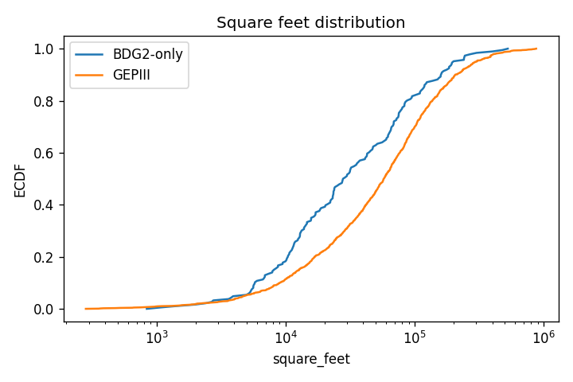
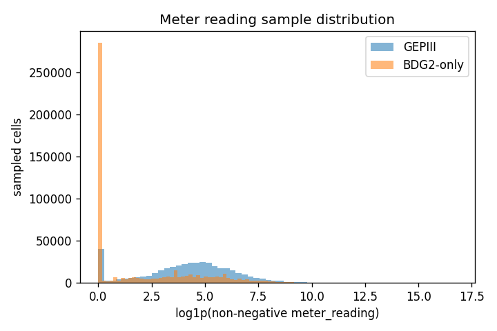

# BDG2 EDA Report

**Date**: 2026-06-30
**Issue**: [#40](https://github.com/kuokuant-oss/lead-reproduction/issues/40)
**Plan**: [docs/plans/bdg2-eda-plan.md](../plans/bdg2-eda-plan.md)

## Scope And Guardrails

This is a read-only, pre-modeling EDA slice. It reads BDG2 from `data/raw/bdg2`
and reads GEPIII comparison data from frozen GEPIII sources (`load_m3_frame` and
`data/raw/m3/building_metadata.csv`). It does not build a model, create scores,
fabricate labels, report supervised BDG2 metrics, or make readiness/transfer
claims.

The report uses neutral data-quality terms: zero-reading share, negative-reading
share, flatline share, missingness, coverage, and distribution distance.

## Headline Findings

+ BDG2 contains 1,636 buildings, but meter availability is
  highly uneven across meters.
+ Electricity is broadly available; chilledwater, steam, hotwater, gas, water,
  irrigation, and solar have much narrower building coverage.
+ Several meters show high zero-reading or flatline shares, especially
  irrigation, water, gas, and hotwater. These can reflect operational
  off-periods described by Miller et al. 2020, not data faults.
+ Cleaned files increase null rates for every meter, reflecting BDG2's own
  outlier/zero removal rules described by Miller et al. 2020: Twitter
  AnomalyDetection outlier removal, removal of zero-reading runs longer than 24
  hours, and removal of electricity zeros. This is a data-quality delta, not a
  label.
+ For BDG2-only buildings, chilledwater is especially underpowered: of the
  187 BDG2-only buildings, 26 have
  chilledwater columns but only 3 meet the
  sufficient-observation rule (`missing_rate <= 0.50`); this reproduces the
  Phase E Step 4 stop point from the data side.
+ The GEPIII comparison is used only to contextualize coverage and distribution
  differences, not to make modeling or transfer-readiness claims.

## Dataset Provenance And Cleaning

The BDG2 data descriptor is tracked in
[docs/reference/papers/bdg2-miller-2020.md](../reference/papers/bdg2-miller-2020.md).
The PDF is kept locally at `docs/reference/papers/bdg2-miller-2020.pdf` and is
gitignored because it exceeds the repo's 500 KB large-file gate.

Miller et al. 2020 describe the raw release pipeline as unit conversion,
negative readings set to missing, removal of meters with more than 50% negative
readings, removal of meters with more than 100 consecutive days of missing
readings, log plus three-standard-deviation outlier removal, and four-decimal
rounding. The cleaned release then applies additional Twitter AnomalyDetection
outlier removal, removes zero-reading runs longer than 24 hours, and removes
electricity zeros. These release-level rules explain why raw negative-reading
share is zero in this EDA and why cleaned null rates are higher than raw null
rates for every meter.

## BDG2 Data-Quality Inventory

### Per-Meter Structure

| Meter | Buildings | BDG2-only buildings | Raw null | Cleaned null | Raw zero | Raw negative | Raw flatline |
| --- | --- | --- | --- | --- | --- | --- | --- |
| electricity | 1578 | 151 | 0.04739 | 0.08929 | 0.04189 | 0 | 0.1539 |
| chilledwater | 555 | 26 | 0.06948 | 0.07766 | 0.1654 | 0 | 0.1967 |
| steam | 370 | 3 | 0.1126 | 0.1218 | 0.1284 | 0 | 0.177 |
| hotwater | 185 | 19 | 0.06201 | 0.07425 | 0.3294 | 0 | 0.4551 |
| gas | 177 | 52 | 0.03337 | 0.0477 | 0.3776 | 0 | 0.4609 |
| water | 146 | 25 | 0.05783 | 0.06938 | 0.481 | 0 | 0.5284 |
| irrigation | 37 | 20 | 0.107 | 0.1189 | 0.7662 | 0 | 0.8319 |
| solar | 5 | 0 | 0.2013 | 0.2172 | 0.2719 | 0 | 0.331 |

### Flatline Definition

Flatline share is reported with an explicit rule: minimum run length
`2`; zero-reading runs are
`included`; missing values
break runs; equality is `exact`. The denominator is
adjacent non-missing building-meter-hour comparisons; aggregation is cell-weighted adjacent comparisons.
Zero-reading share is reported separately, so zero prevalence is not hidden
inside the flatline statistic.

### Missingness Decomposition

This table separates building-level meter availability from observation-level
missingness. `Absent buildings` means metadata buildings without a column in the
wide meter file.

| Meter | Absent buildings | Median timestamp coverage | Raw observation missingness | Cleaned observation missingness |
| --- | --- | --- | --- | --- |
| electricity | 58 | 0.9985 | 0.04739 | 0.08929 |
| chilledwater | 1081 | 0.999 | 0.06948 | 0.07766 |
| steam | 1266 | 0.999 | 0.1126 | 0.1218 |
| hotwater | 1451 | 0.9998 | 0.06201 | 0.07425 |
| gas | 1459 | 1 | 0.03337 | 0.0477 |
| water | 1490 | 0.9968 | 0.05783 | 0.06938 |
| irrigation | 1599 | 0.9444 | 0.107 | 0.1189 |
| solar | 1631 | 0.9987 | 0.2013 | 0.2172 |

### Cleaned-Vs-Raw Delta

| Meter | Null-rate delta | Raw present -> cleaned missing | Raw missing -> cleaned present | Changed observed cells |
| --- | --- | --- | --- | --- |
| electricity | 0.04189 | 0.04189 | 0 | 0.0004208 |
| chilledwater | 0.00818 | 0.00818 | 0 | 0.005495 |
| steam | 0.009229 | 0.009229 | 0 | 0.00359 |
| hotwater | 0.01224 | 0.01224 | 0 | 0.001415 |
| gas | 0.01433 | 0.01433 | 0 | 0.0005059 |
| water | 0.01155 | 0.01155 | 0 | 0.00391 |
| irrigation | 0.01195 | 0.01195 | 0 | 0.001761 |
| solar | 0.01595 | 0.01595 | 0 | 0 |

For every meter, raw-to-cleaned missing is positive and raw missing-to-cleaned
present is zero; consistent with cleaned files removing additional observations
rather than filling raw gaps.

### Metadata Completeness

| Field | Source column | Usage | BDG2 non-null | BDG2 summary | BDG2-only summary | GEPIII-overlap summary |
| --- | --- | --- | --- | --- | --- | --- |
| primary_use | primaryspaceusage | headline_distance | 0.9872 | top Education (617) | top Education (68) | top Education (549) |
| square_feet | sqft | headline_distance | 1 | median 5.462e+04 | median 2.786e+04 | median 5.767e+04 |
| sqm | sqm | descriptive_only | 1 | median 5074 | median 2588 | median 5358 |
| year_built | yearbuilt | descriptive_only | 0.4994 | median 1971 | median 1976 | median 1970 |
| floor_count | numberoffloors | descriptive_only | 0.2696 | median 2 | median 2 | median 3 |
| site_id | site_id | descriptive_only | 1 | top Rat (305) | top Lamb (58) | top Rat (274) |
| timezone | timezone | descriptive_only | 1 | top US/Eastern (812) | top Europe/London (75) | top US/Eastern (739) |

## BDG2-Only Sufficiency

BDG2 has 187 BDG2-only buildings and
1,449 GEPIII-overlap buildings. The table below
summarizes BDG2-only meter availability and the sufficient-observation split.
For chilledwater, 26 BDG2-only buildings have meter
columns, 3 meet the `missing_rate <= 0.50` rule, and
23 are high-missing. This is the data-side reason the
Phase E Step 4 chilledwater frame remains underpowered.

| Meter | BDG2-only with meter | Sufficient obs | High missing | Median missing rate |
| --- | --- | --- | --- | --- |
| electricity | 151 | 99 | 52 | 0 |
| chilledwater | 26 | 3 | 23 | 0.5024 |
| steam | 3 | 3 | 0 | 0 |
| hotwater | 19 | 2 | 17 | 0.5018 |
| gas | 52 | 50 | 2 | 0 |
| water | 25 | 23 | 2 | 0.01146 |
| irrigation | 20 | 20 | 0 | 0.05424 |
| solar | 0 | 0 | 0 | n/a |

### Chilledwater Sufficiency Threshold Sensitivity

| Missing-rate threshold | Sufficient BDG2-only chilledwater buildings |
| --- | --- |
| 0.40 | 2 |
| 0.45 | 2 |
| 0.50 | 3 |
| 0.55 | 24 |
| 0.60 | 24 |

The verdict is gate-sensitive because relaxed thresholds sharply
increase the eligible building count.

### BDG2-Only Top-Site Contribution

| Site | BDG2-only buildings | BDG2-only chilledwater columns | BDG2-only chilledwater sufficient obs |
| --- | --- | --- | --- |
| Lamb | 58 | 0 | 0 |
| Panther | 31 | 0 | 0 |
| Rat | 31 | 0 | 0 |
| Swan | 21 | 20 | 0 |

## GEPIII Comparison As Context

The GEPIII comparison is a diagnostic lens for coverage and distribution
differences. It is not a modeling result, not a transfer result, and not a
readiness claim.

### Meter Coverage Context

| Meter | All buildings marked yes | BDG2-only | GEPIII-overlap |
| --- | --- | --- | --- |
| electricity | 1578 | 151 | 1427 |
| chilledwater | 555 | 26 | 529 |
| steam | 370 | 3 | 367 |
| hotwater | 185 | 19 | 166 |
| gas | 177 | 52 | 125 |
| water | 146 | 25 | 121 |
| irrigation | 37 | 20 | 17 |
| solar | 5 | 0 | 5 |

Primary-use unseen/unmapped rate for BDG2-only vs GEPIII is
`0.1123`.
Unseen or unmapped normalized categories:
`(missing/unmapped)`.

Square-feet medians:

+ BDG2-only: `2.786e+04`.
+ GEPIII-overlap: `5.767e+04`.
+ GEPIII: `5.767e+04`.

BDG2-only buildings are concentrated in a smaller set of sites, especially
Lamb, Panther, Rat, and Swan in the local archive. Meter availability differs
sharply by meter. Electricity is broadest; solar and irrigation remain narrow.
Chilledwater has enough overlap buildings for a bridge baseline but not enough
BDG2-only sufficient-observation buildings for the prior Step 4 frame.

### Reference Distribution Distances

| Feature | KS | PSI | Basis |
| --- | --- | --- | --- |
| square_feet | 0.2176 | 0.2235 | BDG2-only vs GEPIII metadata |
| meter_reading | 0.4549 | 1.102 | sampled raw BDG2-only cells vs GEPIII `load_m3_frame` cells |
| primary_use coverage | n/a | 1.415 | categorical PSI; unseen/unmapped rate 0.1123 |

The meter_reading distance compares sampled BDG2 raw cells against GEPIII
Kaggle-release cells via `load_m3_frame`. Part of this distance reflects known
release-level differences described by Miller et al. 2020: meter-type mix,
zero inflation, site composition, Kaggle unit-conversion errors, and
UTC-vs-local weather timestamps that BDG2 raw/cleaned fixed but the Kaggle
subset left as-is. It should therefore not be read as building behavior alone;
future refinement should prioritize per-meter, log1p, and zero-excluded
distances.

### Per-Meter Reference Distances

| Meter | Variant | KS | PSI | BDG2-only zero share | GEPIII zero share |
| --- | --- | --- | --- | --- | --- |
| electricity | raw_zero_included | 0.4447 | 1.017 | 0.2095 | 0.04376 |
| electricity | log1p_zero_included | 0.4447 | 1.017 | 0.2095 | 0.04376 |
| electricity | log1p_zero_excluded | 0.3799 | 0.8278 | 0.2095 | 0.04376 |
| chilledwater | raw_zero_included | 0.1177 | 0.08789 | 0.2543 | 0.1568 |
| chilledwater | log1p_zero_included | 0.1177 | 0.08789 | 0.2543 | 0.1568 |
| chilledwater | log1p_zero_excluded | 0.06005 | 0.07149 | 0.2543 | 0.1568 |
| steam | raw_zero_included | 0.5237 | 1.24 | 0.6224 | 0.1279 |
| steam | log1p_zero_included | 0.5237 | 1.24 | 0.6224 | 0.1279 |
| steam | log1p_zero_excluded | 0.1391 | 0.3773 | 0.6224 | 0.1279 |
| hotwater | raw_zero_included | 0.3487 | 1.66 | 0.4643 | 0.27 |
| hotwater | log1p_zero_included | 0.3487 | 1.66 | 0.4643 | 0.27 |
| hotwater | log1p_zero_excluded | 0.4582 | 2.322 | 0.4643 | 0.27 |

Figures:

+ 
+ 

Figure sizes:

| Figure | Bytes |
| --- | --- |
| docs/assets/bdg2-eda/square-feet-ecdf.png | 31412 |
| docs/assets/bdg2-eda/meter-reading-hist.png | 25387 |

## Temporal Profiles

The provenance JSON includes hour/month mean profiles for representative
electricity and chilledwater raw readings. These are descriptive profiles only;
they are not model features, scores, or readiness evidence.

+ electricity has its highest mean reading around hour 14 and lowest around hour 3; by month it peaks in 8 and is lowest in 12.
+ chilledwater has its highest mean reading around hour 20 and lowest around hour 8; by month it peaks in 7 and is lowest in 12.

## Methodological Caveats And Review Notes

+ Released-raw negative-reading share is measured on the released BDG2 raw
  files. It does not imply the original site-source feeds never contained
  negative readings: Miller et al. 2020 describe setting negative readings to
  missing and removing meters with more than 50% negative readings during
  release processing.
+ Cleaned null rate above raw null rate is a data-quality delta, not a label.
  Miller et al. 2020 describe the cleaned files as applying Twitter
  AnomalyDetection outlier removal, removing zero-reading runs longer than
  24 hours, and removing electricity zeros.
+ Pooled meter_reading KS/PSI is a headline diagnostic only. It mixes meter-type
  composition, zero inflation, site composition, and known BDG2-vs-GEPIII
  release-regime differences; it should not be interpreted as a pure building
  behavior distance.

## Provenance

+ Machine-readable summary: `data/processed/bdg2_eda.json` (gitignored shard).
+ Script: `scripts/run_bdg2_eda.py`.
+ BDG2 source: `data/raw/bdg2`.
+ BDG2 paper reference: `docs/reference/papers/bdg2-miller-2020.md`.
+ GEPIII comparison source: `load_m3_frame(verbose=False)` and
  `data/raw/m3/building_metadata.csv`.
+ Distance scalar sampling: per-meter BDG2 sample
  `80000`, GEPIII sample
  `400000`, seed
  `42`.
