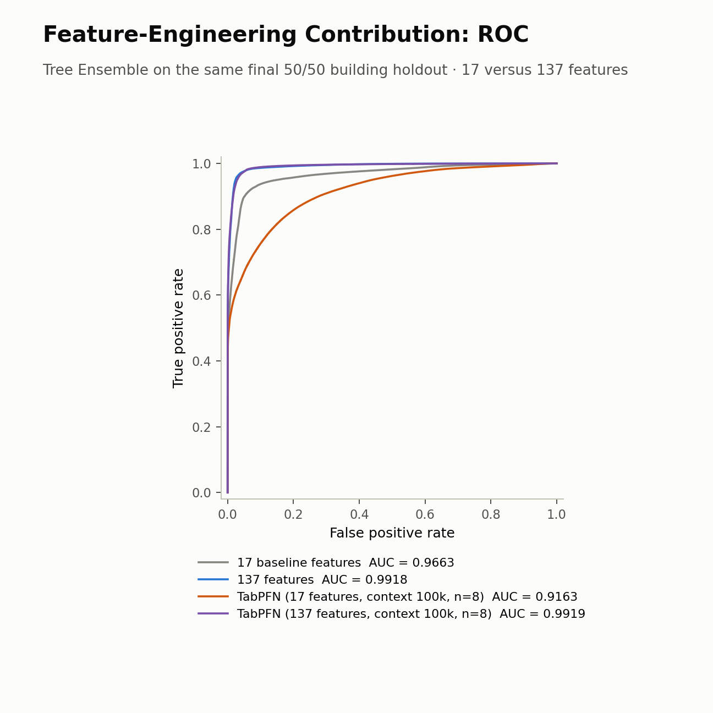
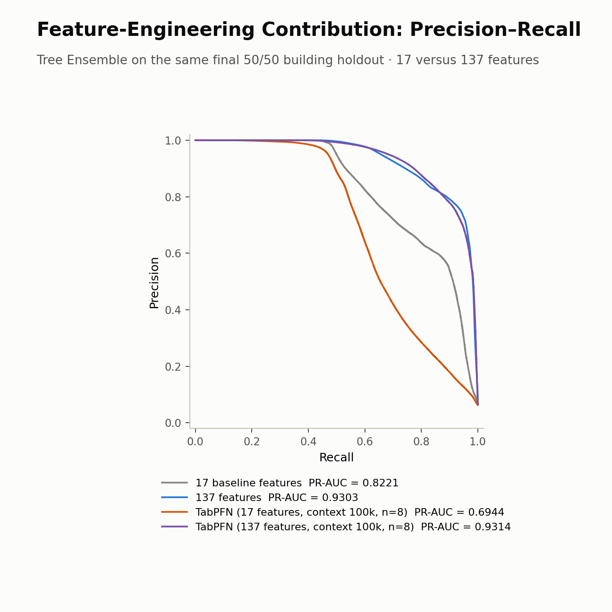
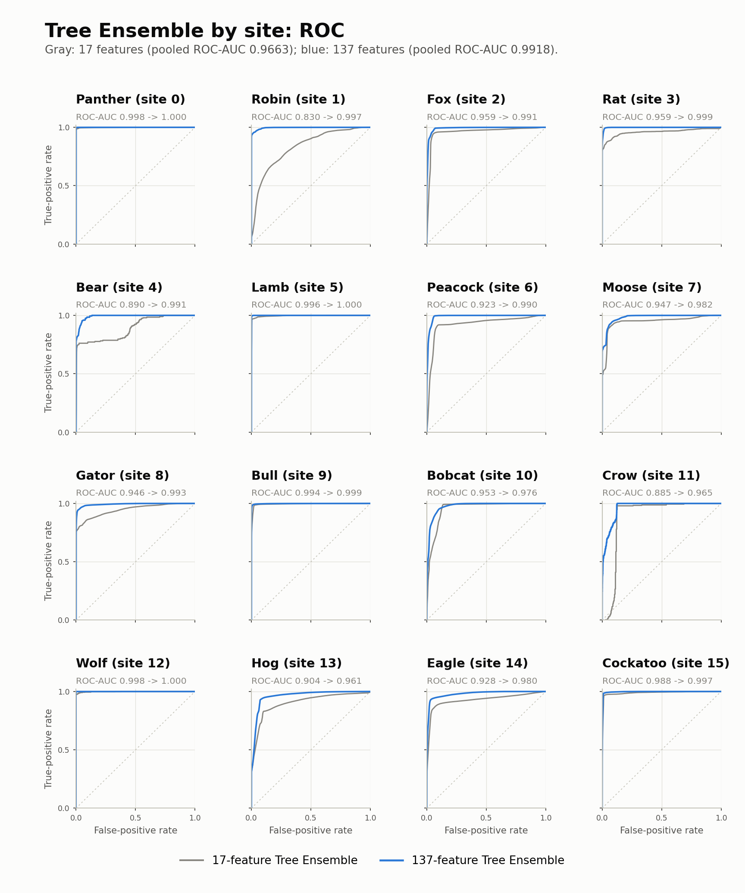
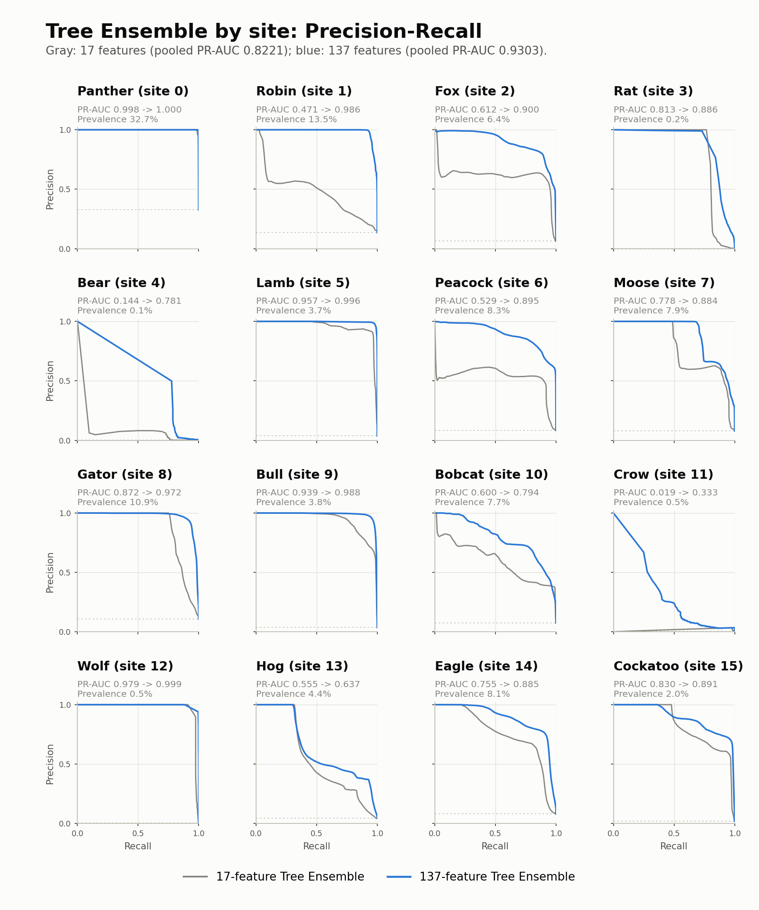
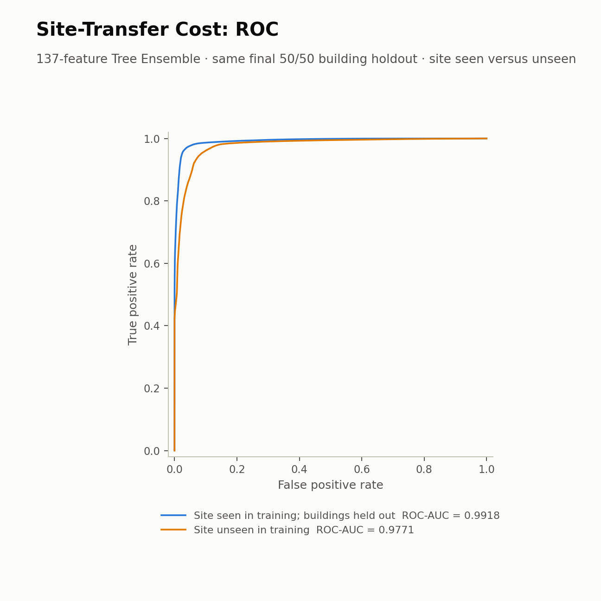
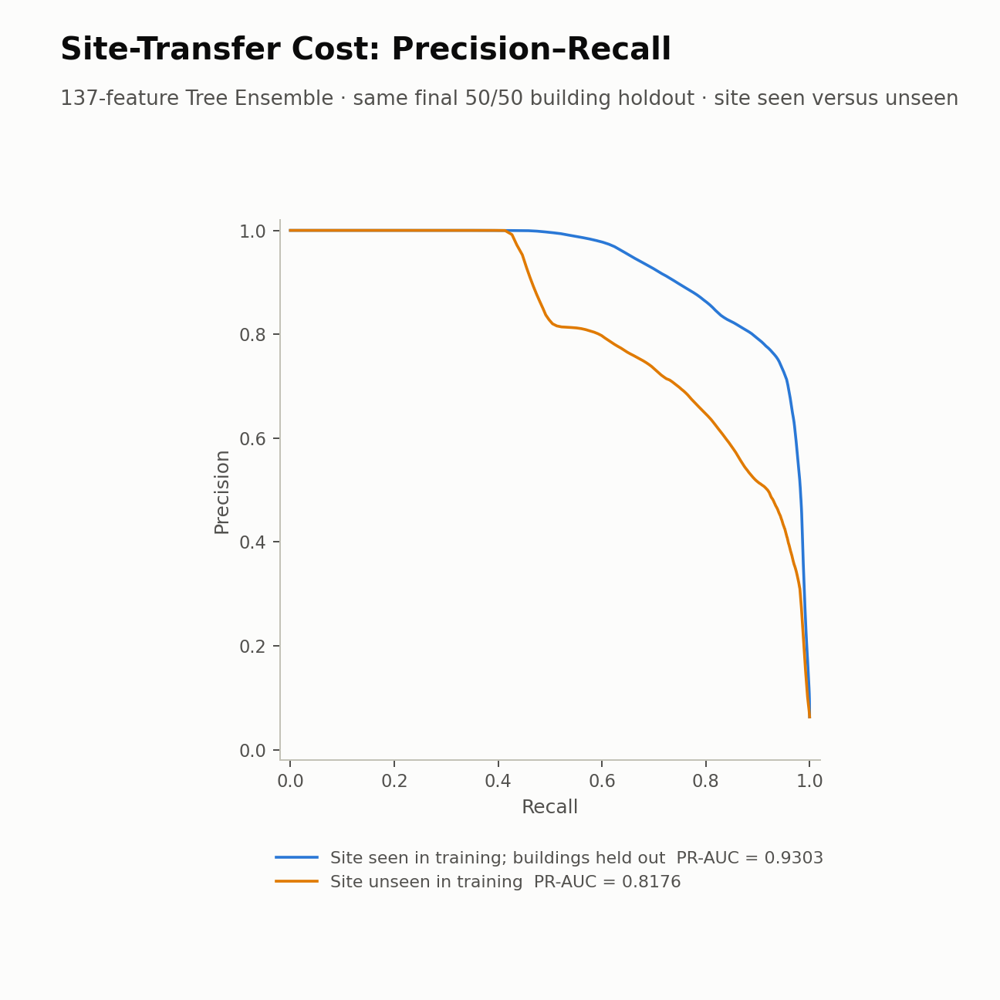
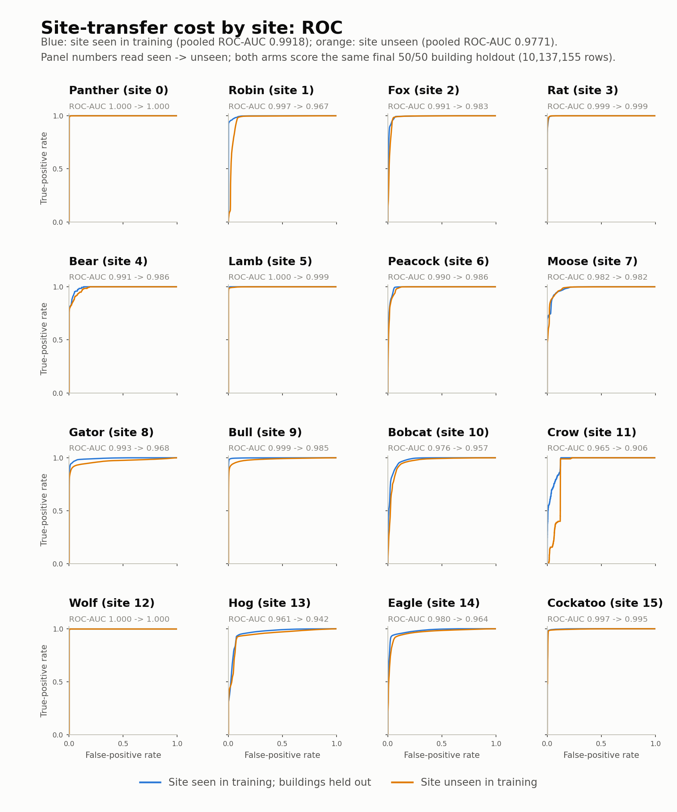
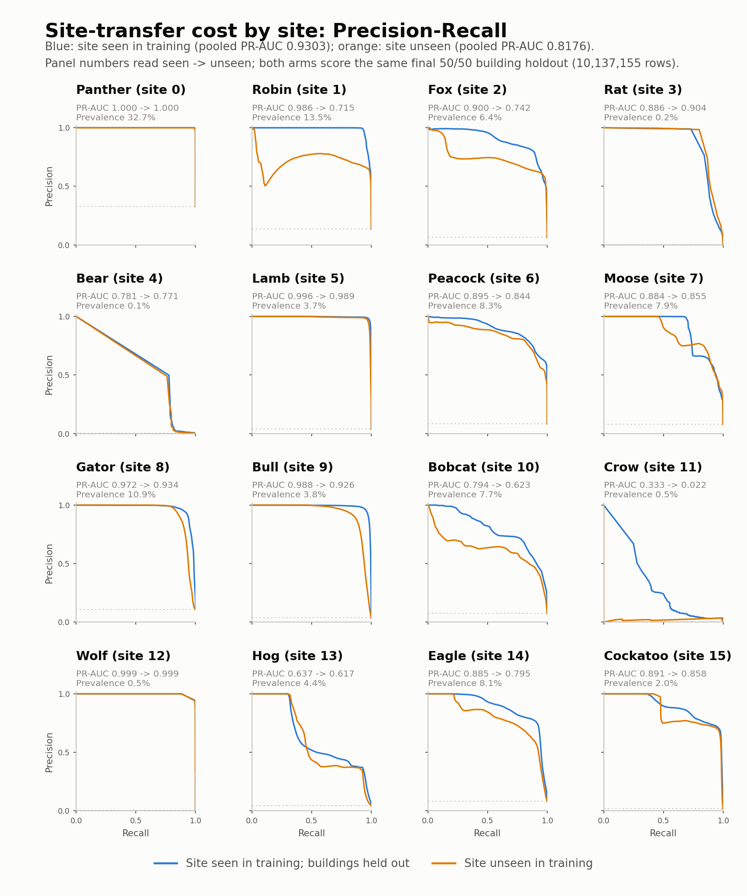

# 實驗設定（Experimental Setup）

+ **狀態**：完成
+ **日期**：2026-07-27
+ **範圍**：本文件是論文「實驗設定」章節的中文底稿，涵蓋 GEPIII 異常偵測的資料、
  特徵、模型、評估協定與四組實驗（E1–E4），並附上各組對應的結果圖。

## 主要程式碼

+ 50/50 觀測與四模型集成：[scripts/run_m3_figure_observations.py](../../scripts/run_m3_figure_observations.py)
+ 17 維對照集成：[scripts/run_m3_17_feature_ensemble.py](../../scripts/run_m3_17_feature_ensemble.py)
+ TabPFN 擬合（17 / 137 維）：[scripts/fit_m5_tabpfn_17_context100000.py](../../scripts/fit_m5_tabpfn_17_context100000.py)、[scripts/fit_m5_tabpfn_137_context100000.py](../../scripts/fit_m5_tabpfn_137_context100000.py)
+ Site 遷移實驗：[scripts/run_m6_site_transfer.py](../../scripts/run_m6_site_transfer.py)、[scripts/m6_site_transfer_protocol.py](../../scripts/m6_site_transfer_protocol.py)
+ 特徵與切分核心：[src/lead/features.py](../../src/lead/features.py)、[src/lead/data.py](../../src/lead/data.py)、[src/lead/sample.py](../../src/lead/sample.py)

---

# 1. 資料集與標註

實驗使用 **GEPIII（ASHRAE Great Energy Predictor III）** 的逐小時電表量測資料，以其公開的異常標註作為監督訊號。

| 來源 | 內容 |
|---|---|
| `train.csv` | `building_id`、`meter`、`timestamp`、`meter_reading` |
| `bad_meter_readings.csv` | 二元標註 `is_bad_meter_reading` |
| `building_metadata.csv` | `site_id`、`primary_use`、`square_feet`、`year_built`、`floor_count` |
| `weather_train.csv` | site 層級逐小時氣象觀測 |

標註與量測以列位置一對一對齊，並於載入時驗證三項不變量：兩檔列數相等、量測檔維持原始列序、`(building_id, meter, timestamp)` 三元組唯一。氣象資料以 `(site_id, timestamp)` 左接合，`cloud_coverage` 的哨符值 255 還原為 10。建物屬性以 `building_id` 左接合，`primary_use` 採標籤編碼，`square_feet` 取 `log(1+x)`。

全表 **20,216,100 列**、**1,449 棟建物**、**16 個 site**、**1,314,474 個正樣本**（整體正類率 6.50%）。時間衍生欄位為 `hour`、`weekday`、`month`、`dayofyear`（定義為 day-of-year + hour/24 的連續值）。

---

# 2. 資料切分

採**建物互斥（building-disjoint）**的 50/50 切分，規則為 `building_id mod 2`：偶數建物為訓練來源，奇數建物為 holdout。

**表 1.** 主切分規模。

| | buildings | rows | anomalies | anomaly rate |
|---|---:|---:|---:|---:|
| Training | 725 | 10,078,945 | 677,077 | 6.72% |
| **Holdout** | 724 | **10,137,155** | **637,397** | **6.29%** |

兩側建物集合互斥；16 個 site 在兩側皆有出現。**本文所有評測均在此 10,137,155 列 holdout 上進行**，各實驗 arm 之間為逐列配對比較。

---

# 3. 特徵集

定義兩個巢狀特徵集。

**(a) Baseline，17 維**
`meter`、`meter_reading`、`hour`、`weekday`、`month`、`dayofyear`、`primary_use_enc`、`log_square_feet`、`year_built`、`floor_count`、`air_temperature`、`cloud_coverage`、`dew_temperature`、`precip_depth_1_hr`、`sea_level_pressure`、`wind_direction`、`wind_speed`。

**(b) Engineered，137 維** = 上述 17 維 + 120 維數值變化特徵。

數值變化特徵由 60 個時間位移構成，每個位移產生差值與比值各一：

$$\mathcal{S}=\{-24,\dots,-1\}\cup\{1,\dots,24\}\cup\{-168,-144,\dots,-48\}\cup\{48,72,\dots,168\},\quad|\mathcal{S}|=60$$

$$\mathrm{diff}_n=r_t-r_{t-n},\qquad \mathrm{ratio}_n=\frac{r_t+1}{r_{t-n}+1}$$

$r_{t-n}$ 以 **exact timestamp join** 取得：對同一 `(building_id, meter)`，以 `timestamp + n` 小時做一對一接合，非依列位移，因此不受缺測與不規則取樣影響。位移集合同時涵蓋過去與未來方向（±1–24 小時逐時窗、±48–168 小時逐日窗），故此特徵集屬**離線（offline）**設定。接合未命中保留為 **NaN，不做插補**；全部以 float32 儲存。訓練側與 holdout 側各自獨立建構特徵表。

---

# 4. 訓練集建構

原始訓練集正類佔 6.72%。訓練時採固定的類別平衡程序：保留全部 677,077 個正樣本，另以兩個獨立種子（10、20）各**無放回**抽取等量負樣本，串接為

$$[\,\mathrm{neg}^{(1)},\ \mathrm{pos},\ \mathrm{neg}^{(2)},\ \mathrm{pos}\,]$$

得訓練集 **2,708,308 列**，有效正負比 1:1。Holdout **不做任何重抽樣**，保留原始 6.29% 的類別分布。

特徵標準化採 `StandardScaler`，僅以上述訓練列擬合，再套用至全部 holdout 列；NaN 不參與統計量估計。

---

# 5. 模型

## 5.1 梯度提升樹集成（Tree Ensemble）

四個獨立訓練的梯度提升樹分類器，隨機種子皆為 42：

**表 2.** 模型與超參數。

| 模型 | 超參數 | 缺失值處理 |
|---|---|---|
| LightGBM | `n_estimators=100` | 原生 |
| XGBoost | `n_estimators=100`、`eval_metric=logloss` | 原生 |
| CatBoost | `iterations=1000` | 原生 |
| HistGradientBoosting | `max_iter=100` | NaN 填 0 |

除上表外均使用套件預設值，未進行超參數搜尋。**Tree Ensemble** 為四者輸出機率的等權算術平均：$\hat p=\frac14\sum_{m=1}^{4}\hat p_m$。

## 5.2 表格基礎模型（TabPFN）

採 **TabPFN v3** 分類器之 in-context learning 設定，不更新任何權重。

**表 3.** TabPFN 設定。

| 項目 | 值 |
|---|---|
| Checkpoint | `tabpfn-v3-classifier-v3_default`（以 SHA-256 固定） |
| Context 規模 | 100,000 列 |
| Context 抽樣 | 全部取自訓練半邊；先保留 4,000 列固定驗證列，其餘依標籤做正負各 50,000、交錯排列、無放回的平衡抽樣 |
| 集成大小 | `n_estimators = 8`（關閉自動調整） |
| 前處理 | `StandardScaler`，以 context 擬合 |
| 推論 | 對全部 10,137,155 holdout 列輸出 $P(\text{anomaly})$，GPU 執行，最大 microbatch 20,000 列 |
| 隨機種子 | 42 |

17 維與 137 維兩組 TabPFN 使用**相同的 context 列集合**（以雜湊驗證）、相同 checkpoint、相同集成大小與種子，唯一差異為特徵矩陣維度。

---

# 6. 評估協定

所有 arm 在同一批 holdout 列上評分；比較前以原始列序號、`site_id`、標籤三者逐列驗證全等。

**指標。** 兩個門檻無關的排序指標，皆在全量分數上計算：

+ **ROC-AUC**
+ **PR-AUC**（average precision）；在 6.29% 正類率下對此不平衡任務更具鑑別力

**分層。** 除 pooled 指標外，依 `site_id` 將 holdout 分成 16 個互斥子集獨立評估。分層為評分後的事後操作：所有結果來自在 pooled 訓練集上訓練的**單一全域模型**，不做 per-site 訓練、校準或門檻選擇。

**指標解讀。** ROC-AUC 於分層內計算，與該 site 正類率無關；PR-AUC 的隨機基線即為該 site 正類率 $\pi_k$，僅可比較同一 site 內不同 arm 的差值，不可跨 site 比較絕對值。

**評測母體與覆蓋率。** 各 site 的評測母體為該 site 的**奇數建物子集**（即表 1 的 holdout），涵蓋全體 1,449 棟建物中的 724 棟（50.0%）、20,216,100 列中的 10,137,155 列（50.1%）、1,314,474 個正樣本中的 637,397 個（48.5%）。逐 site 的支撐與覆蓋率列於表 4。

**表 4.** Site 層級評測支撐（所有 arm 共用）。

| site | 名稱 | 評測建物 / site 建物 | 評測列 | 評測正樣本 | $\pi_k$ | 正樣本覆蓋率 |
|---:|---|---:|---:|---:|---:|---:|
| 0 | Panther | 52 / 105 | 538,432 | 176,269 | 32.74% | 49.4% |
| 1 | Robin | 26 / 51 | 289,853 | 39,135 | 13.50% | 50.3% |
| 2 | Fox | 67 / 135 | 1,263,915 | 80,897 | 6.40% | 46.9% |
| 3 | Rat | 137 / 274 | 1,181,463 | 2,684 | 0.23% | 65.2% |
| 4 | Bear | 46 / 91 | 370,460 | 197 | 0.05% | 4.8% |
| 5 | Lamb | 44 / 89 | 386,496 | 14,435 | 3.73% | 48.8% |
| 6 | Peacock | 22 / 44 | 345,117 | 28,654 | 8.30% | 43.0% |
| 7 | Moose | 8 / 15 | 200,594 | 15,886 | 7.92% | 55.0% |
| 8 | Gator | 35 / 70 | 284,376 | 31,083 | 10.93% | 71.4% |
| 9 | Bull | 62 / 124 | 1,367,482 | 52,587 | 3.85% | 42.7% |
| 10 | Bobcat | 15 / 30 | 206,430 | 15,814 | 7.66% | 37.2% |
| 11 | Crow | 2 / 5 | 43,626 | 197 | 0.45% | 4.0% |
| 12 | Wolf | 18 / 36 | 158,011 | 755 | 0.48% | 51.0% |
| 13 | Hog | 77 / 154 | 1,334,223 | 59,283 | 4.44% | 56.1% |
| 14 | Eagle | 51 / 102 | 1,256,775 | 101,532 | 8.08% | 46.8% |
| 15 | Cockatoo | 62 / 124 | 909,902 | 17,989 | 1.98% | 49.7% |
| — | 全體 | **724 / 1,449** | **10,137,155** | **637,397** | 6.29% | **48.5%** |

Site 名稱依 BDG2 metadata 的 `site_id` 對照還原，並驗證與 GEPIII site 編號為雙向一對一。

**估計穩定性與代表性。** Site 4（Bear）與 site 11（Crow）的評測母體各僅含 197 個正樣本，分別對應該 site 全部正樣本的 4.8% 與 4.0%；site 12（Wolf）為 755 個。此量級下 PR-AUC 對少數列的排序變動極為敏感，且該子集對全站母體不具代表性，故本文對此三個 site 的 PR-AUC 僅作定性描述，不據以排序模型或推論該 site 的整體行為。

**pooled 與 macro。** Pooled 指標為列加權，由大型 site 主導：五個 site（2、3、9、13、14）合計佔 63.1% 的評測列，site 0 單獨貢獻 27.7% 的正樣本。因此 pooled 與 site 層級結果並列報告，不以其一取代其一。

---

# 7. 實驗設計

## 7.1 E1：特徵工程的貢獻

固定切分與評測母體，僅改變特徵集與模型族，共四個 arm：

**表 5.** E1 的四個 arm。

| Arm | 模型 | 特徵維度 |
|---|---|---:|
| A1 | Tree Ensemble | 17 |
| A2 | Tree Ensemble | 137 |
| A3 | TabPFN（context 100k, $n{=}8$） | 17 |
| A4 | TabPFN（context 100k, $n{=}8$） | 137 |

A1 與 A2 共用相同訓練列索引、相同超參數與相同集成規則，僅特徵矩陣不同；標準化各自以其特徵子集重新擬合。A3 與 A4 共用相同 context 列集合。(A1, A2) 與 (A3, A4) 的差值分別度量特徵工程對樹集成與對基礎模型的增益；(A2, A4) 度量相同特徵下兩個模型族的差距。四者以 pooled ROC-AUC 與 PR-AUC 報告。

**圖 1.** E1 pooled ROC。四條線評分於同一批 10,137,155 列 holdout。

**圖 2.** E1 pooled Precision–Recall。虛線基線為 holdout 正類率 6.29%。

## 7.2 E2：Site 層級分解

將 A1 與 A2 的 holdout 分數依 `site_id` 分成 16 組，各組獨立計算 ROC-AUC 與 PR-AUC，協定與支撐如第 6 節。由於 site 標籤與模型分數逐列對齊，此分解不需重新訓練；兩 arm 在每個 site 上為同列配對，其差值即為該場域上的特徵工程增益。

**圖 3.** E2 分 site ROC（灰：17 維；藍：137 維）。面板數值讀作 17 維 → 137 維。

**圖 4.** E2 分 site Precision–Recall。各面板虛線為該 site 的正類率 $\pi_k$（表 4）。

## 7.3 E3：Site 遷移代價

固定 137 維特徵與 5.1 節的模型設定，僅改變**訓練資料的地理涵蓋範圍**，比較兩個新穎度層級：

+ **Site seen**：測試建物未見於訓練，但其所屬 site 的其他建物已見。
+ **Site unseen**：測試建物所屬 site 的**任何**建物皆未見於訓練。

**Site-seen arm.** 訓練來源為第 2 節的 725 棟偶數建物（10,078,945 列、677,077 個正樣本），涵蓋全部 16 個 site 與 1,184 條 meter 時序。

**Site-unseen arm.** 採 **site 層級的二折互補劃分**，折的指派依 `site_id` 奇偶：

+ **Fold A**：訓練於 8 個偶數 site $\{0,2,4,6,8,10,12,14\}$；
+ **Fold B**：訓練於 8 個奇數 site $\{1,3,5,7,9,11,13,15\}$。

兩折的訓練 site 集合互補且與各自評分 site 集合不相交，因此**每一列的預測皆來自一個從未接觸該列所屬 site 的模型**。兩折的 out-of-fold 預測合併後，取其落在第 2 節 holdout（奇數建物）上的部分作為本 arm 的分數，使兩個 arm 落在**逐列相同**的評測母體上（表 4）。採二折互補劃分而非 leave-one-site-out，使每個模型的訓練來源仍為 8 個 site 的多場域資料，與 site-seen arm 的 16 個 site 屬同一數量級。

**表 6.** E3 各 arm 的訓練來源（皆採全部可用 meter 時序）。

| Arm / fold | sites | buildings | meter 時序 | 訓練列 | 正樣本 | 正類率 | 平衡後擬合列 |
|---|---:|---:|---:|---:|---:|---:|---:|
| Site-seen | 16 | 725 | 1,184 | 10,078,945 | 677,077 | 6.72% | 2,708,308 |
| Unseen, Fold A | 8 | 613 | 1,033 | 8,818,590 | 904,080 | 10.25% | 3,616,320 |
| Unseen, Fold B | 8 | 836 | 1,347 | 11,397,510 | 410,394 | 3.60% | 1,641,576 |

**表 7.** Site-unseen arm 兩折的訓練側 site 組成。

| Fold A 訓練 site | 建物 | meter | 列 | 正樣本 |
|---|---:|---:|---:|---:|
| 0 Panther | 105 | 129 | 1,076,662 | 356,496 |
| 2 Fox | 135 | 289 | 2,530,312 | 172,476 |
| 4 Bear | 91 | 91 | 746,746 | 4,087 |
| 6 Peacock | 44 | 80 | 668,133 | 66,658 |
| 8 Gator | 70 | 70 | 567,915 | 43,504 |
| 10 Bobcat | 30 | 50 | 411,407 | 42,499 |
| 12 Wolf | 36 | 36 | 315,909 | 1,479 |
| 14 Eagle | 102 | 288 | 2,501,506 | 216,881 |

| Fold B 訓練 site | 建物 | meter | 列 | 正樣本 |
|---|---:|---:|---:|---:|
| 1 Robin | 51 | 63 | 553,357 | 77,779 |
| 3 Rat | 274 | 274 | 2,370,097 | 4,117 |
| 5 Lamb | 89 | 89 | 781,776 | 29,575 |
| 7 Moose | 15 | 42 | 366,681 | 28,905 |
| 9 Bull | 124 | 306 | 2,679,323 | 123,167 |
| 11 Crow | 5 | 14 | 119,459 | 4,978 |
| 13 Hog | 154 | 309 | 2,711,763 | 105,665 |
| 15 Cockatoo | 124 | 250 | 1,815,054 | 36,208 |

三個 cell 皆使用其來源側全部可用的 meter 時序（1,184 / 1,033 / 1,347 條，涵蓋率 100%，來源 site 全數涵蓋），差異僅來自劃分規則本身。由於類別平衡程序保留全部正樣本並配以等量負樣本，平衡後的擬合列數與來源正樣本數成正比，故三者的擬合規模不同（表 6 末欄）。

**報告方式與限定。** Site-unseen 的 pooled 指標由合併後的 out-of-fold 預測一次計算，而非兩折指標的平均；分層報告則依 `site_id` 切開，各 site 的分數完全來自單一折。兩 arm 的差值應解讀為「**以 site 為單位劃分訓練資料所付出的整體代價**」，其中同時包含目標 site 分布未被見過，以及訓練集組成與規模改變兩個成分；表 6 與表 7 提供判斷後者量級的依據。各 site 的比較受表 4 的覆蓋率限定。

**圖 5.** E3 pooled ROC。兩 arm 評分於逐列相同的 10,137,155 列。

**圖 6.** E3 pooled Precision–Recall。

**圖 7.** E3 分 site ROC（藍：site seen；橘：site unseen）。面板數值讀作 seen → unseen。

**圖 8.** E3 分 site Precision–Recall。各面板的支撐與正樣本覆蓋率見表 4；site 4、11、12 的估計不具代表性。

## 7.4 E4：置換重要度

針對 137 維 Tree Ensemble 評估各特徵的邊際貢獻。

**表 8.** E4 設定。

| 項目 | 值 |
|---|---|
| 評估樣本 | 自 holdout **分層抽樣 50,000 列**，維持原始正類率 |
| 受測特徵 | 全部 137 維，逐一處理 |
| 程序 | 於樣本內隨機置換單一特徵欄，四個成員模型重新推論並重新集成 |
| 重複次數 | 每特徵 3 次獨立置換 |
| 統計量 | ROC-AUC 相對未置換基線的下降量，取 3 次平均（標準差與 PR-AUC 下降量同步記錄） |
| 種子 | 42（樣本抽取與置換） |

報告時取下降量最大的前 10 個特徵。此指標度量**已訓練模型對該特徵的依賴度**，非移除該特徵重新訓練後的效能損失；在特徵高度相關時（本特徵集含 60 個位移的差值與比值）會低估群體重要度，故不作為特徵選擇的依據。

**圖 9.** E4 Tree Ensemble 置換重要度，取其自身下降量前 10 名。x 軸刻度與其他模型的重要度圖共用。

---

# 8. 可重現性

全流程為確定性設定：模型種子 42；負樣本抽樣種子 10 與 20；分層抽樣與置換種子 42；TabPFN context 抽樣與推論種子 42。特徵定義、切分規則、平衡程序與模型超參數皆凍結，執行時對切分規模（建物數、列數）與五個模型的 pooled ROC-AUC 施加容忍度 $5\times10^{-4}$ 的數值檢查，不符即中止。全部預測分數連同列身分欄位（原始列序號、`site_id`、`building_id`、`meter`、時間戳、標籤）保存，所有 pooled 與分層指標均可由該檔重算。
