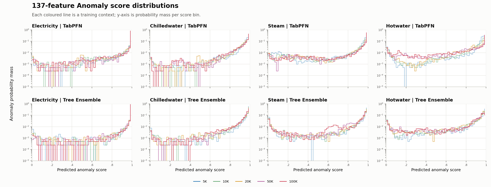
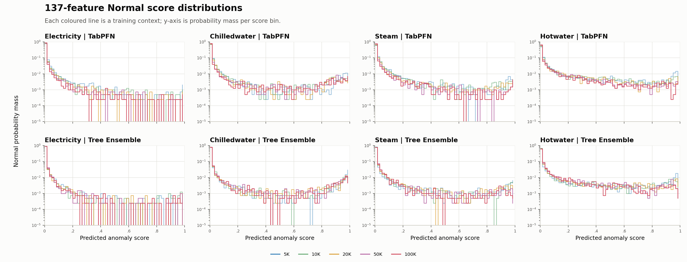
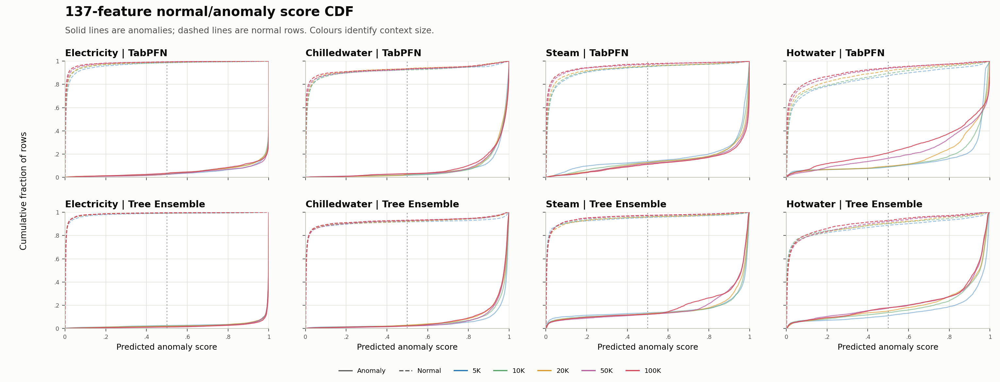
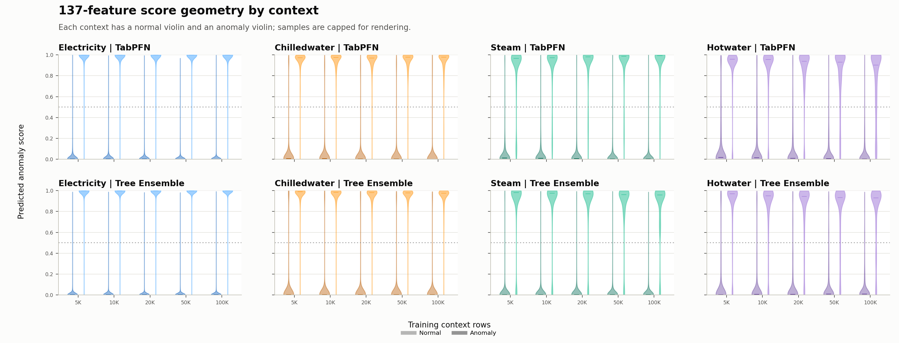

# M5 context-construction screening：完整結果與後續論文方向

## 1. 研究問題與結果邊界

本 screening 固定 training budget、label ratio、query rows 與 model
configuration，只改 training context 的 meter composition，觀察 TabPFN 與 Tree
ensemble 在 F0 / 17 features 與 F4 / 137 features 下的反應。

本文件依序保存：

1. 實驗與執行規格；
2. 每個 cell 的 runtime；
3. pooled、per-meter、per-site 絕對指標；
4. context、feature 與 model 的 paired differences；
5. row-level counterfactual sensitivity；
6. 數據直接支持與尚不支持的描述；
7. 可並行推進的論文方向。

這是 352-row、50/50 label-balanced query screening，不是 natural-prevalence
full holdout。所有 PR-AUC、ROC-AUC 與 threshold crossing 都只能在這個 query
contract 內解讀。

## 2. 實驗規格

| 項目 | 設定 |
| --- | --- |
| Models | TabPFN-3、frozen Tree ensemble |
| Features | F0 = 17；F4 = 137 |
| Contexts | pooled reference、meter balanced、hotwater-heavy 0.5、hotwater-excluded |
| Context rows | 每 cell 20,000 |
| Context labels | 10,000 positive / 10,000 negative |
| TabPFN estimators | 8 |
| TabPFN subsampling | `SUBSAMPLE_SAMPLES=None` |
| Context/model seed | 42 |
| Query rows | 352 |
| Query labels | 176 positive / 176 negative |
| Model cells | Tree 8；TabPFN 8；合計 16 |
| Metric groups | pooled + 4 meters + 4 sentinel sites = 每 model 72 rows |

Meter mapping：

| ID | Meter | Query rows | Positive |
| ---: | --- | ---: | ---: |
| 0 | electricity | 128 | 64 |
| 1 | chilledwater | 128 | 64 |
| 2 | steam | 64 | 32 |
| 3 | hotwater | 32 | 16 |

Sentinel-site query support：

| Site | Name | Query rows | Positive |
| ---: | --- | ---: | ---: |
| 0 | Panther | 64 | 32 |
| 2 | Fox | 96 | 48 |
| 6 | Peacock | 96 | 48 |
| 9 | Bull | 96 | 48 |

所有 context/query digests、20,000 fitted rows、8 fitted estimators、label
balance、score finiteness 與 no-subsampling gates 均通過。Tree 與 TabPFN 使用相同
context manifests 與 query order。

## 3. 執行結果與成本

### 3.1 Tree

- 8/8 cells 完成；
- 本機 CPU wall time 約 15 分鐘；
- 大部分 wall time 來自一次性的 F4 feature construction；
- 產生 72 rows metrics 與 704 rows counterfactual sensitivity。

### 3.2 TabPFN

本機 RTX 4070 Laptop GPU 8 GiB，單 worker 順序執行，未設定 timeout。

| Features | Context | Fit 秒 | Predict 秒 | Peak GPU MiB |
| --- | --- | ---: | ---: | ---: |
| F0 | meter balanced | 2.216 | 13.353 | 998.0 |
| F0 | hotwater-excluded | 1.538 | 12.325 | 998.8 |
| F0 | hotwater-heavy 0.5 | 1.445 | 12.331 | 998.0 |
| F0 | pooled reference | 1.461 | 12.383 | 998.0 |
| F4 | meter balanced | 1.493 | 27.733 | 1,615.3 |
| F4 | hotwater-excluded | 1.509 | 27.647 | 1,615.4 |
| F4 | hotwater-heavy 0.5 | 1.535 | 27.776 | 1,615.3 |
| F4 | pooled reference | 1.621 | 27.728 | 1,615.3 |

合計：

- 8/8 cells 完成；
- wall time 約 3 分 42 秒；
- summed fit time 12.82 秒；
- summed prediction time 161.28 秒；
- maximum Torch allocated memory 1.58 GiB；
- 產生 72 rows metrics、72 rows paired model differences 與 704 rows
  counterfactual sensitivity。

本次沒有建立 gputw.ai pod，也沒有外接 GPU 費用。相同規模的 screening
應優先留在本機；RTX 5090 只保留給被選中的 full-holdout confirmation。

## 4. Pooled 指標資料帳

本節只保留完整數值，供核對與重算；它不是 findings section。Pooled aggregate
會混合不同 positive/negative domain pairs，第 8 節才進行可解釋的分解。

### 4.1 PR-AUC 與 ROC-AUC

| Model | Features | Context | PR-AUC | ROC-AUC |
| --- | --- | --- | ---: | ---: |
| TabPFN | F0 | pooled reference | 0.9181 | 0.9067 |
| TabPFN | F0 | meter balanced | 0.9184 | 0.9077 |
| TabPFN | F0 | hotwater-heavy 0.5 | 0.9185 | 0.9058 |
| TabPFN | F0 | hotwater-excluded | 0.9175 | 0.9059 |
| TabPFN | F4 | pooled reference | 0.9884 | 0.9859 |
| TabPFN | F4 | meter balanced | 0.9891 | 0.9874 |
| TabPFN | F4 | hotwater-heavy 0.5 | 0.9877 | 0.9849 |
| TabPFN | F4 | hotwater-excluded | 0.9748 | 0.9750 |
| Trees | F0 | pooled reference | 0.9494 | 0.9341 |
| Trees | F0 | meter balanced | 0.9444 | 0.9338 |
| Trees | F0 | hotwater-heavy 0.5 | 0.9385 | 0.9239 |
| Trees | F0 | hotwater-excluded | 0.9430 | 0.9298 |
| Trees | F4 | pooled reference | 0.9885 | 0.9861 |
| Trees | F4 | meter balanced | 0.9873 | 0.9856 |
| Trees | F4 | hotwater-heavy 0.5 | 0.9867 | 0.9851 |
| Trees | F4 | hotwater-excluded | 0.9868 | 0.9846 |

### 4.2 Context 相對 pooled reference 的 pooled PR difference

\[
E_M(c)=\operatorname{PR}_M(c)-\operatorname{PR}_M(\text{pooled reference})
\]

| Context | TabPFN F0 | Trees F0 | TabPFN F4 | Trees F4 |
| --- | ---: | ---: | ---: | ---: |
| meter balanced | +0.0004 | -0.0050 | +0.0007 | -0.0012 |
| hotwater-heavy 0.5 | +0.0005 | -0.0109 | -0.0007 | -0.0018 |
| hotwater-excluded | -0.0006 | -0.0064 | -0.0136 | -0.0017 |

## 5. Per-meter 絕對 PR-AUC

欄位為同一 model/feature 在四種 contexts 下的絕對 PR-AUC。

| Model | Features | Meter | Pooled | Balanced | Heavy | Excluded |
| --- | --- | --- | ---: | ---: | ---: | ---: |
| TabPFN | F0 | electricity | 0.9374 | 0.9394 | 0.9349 | 0.9424 |
| TabPFN | F0 | chilledwater | 0.8569 | 0.8678 | 0.8739 | 0.8498 |
| TabPFN | F0 | steam | 0.9608 | 0.9327 | 0.9337 | 0.9303 |
| TabPFN | F0 | hotwater | 0.7877 | 0.7138 | 0.7352 | 0.9604 |
| TabPFN | F4 | electricity | 0.9920 | 0.9933 | 0.9923 | 0.9915 |
| TabPFN | F4 | chilledwater | 0.9989 | 0.9971 | 0.9963 | 0.9993 |
| TabPFN | F4 | steam | 0.9556 | 0.9831 | 0.9784 | 0.9227 |
| TabPFN | F4 | hotwater | 0.9618 | 0.9398 | 0.9257 | 0.7751 |
| Trees | F0 | electricity | 0.9376 | 0.9378 | 0.9265 | 0.9362 |
| Trees | F0 | chilledwater | 0.9377 | 0.9073 | 0.9290 | 0.9097 |
| Trees | F0 | steam | 0.9806 | 0.9781 | 0.9857 | 0.9652 |
| Trees | F0 | hotwater | 0.9614 | 0.9010 | 0.8950 | 0.9634 |
| Trees | F4 | electricity | 0.9926 | 0.9940 | 0.9951 | 0.9931 |
| Trees | F4 | chilledwater | 0.9974 | 0.9976 | 0.9972 | 0.9983 |
| Trees | F4 | steam | 0.9833 | 0.9806 | 0.9819 | 0.9717 |
| Trees | F4 | hotwater | 0.9175 | 0.9122 | 0.8989 | 0.9230 |

### 5.1 Hotwater-excluded − pooled reference

| Model | Features | Electricity | Chilledwater | Steam | Hotwater |
| --- | --- | ---: | ---: | ---: | ---: |
| TabPFN | F0 | +0.0050 | -0.0071 | -0.0306 | +0.1727 |
| TabPFN | F4 | -0.0005 | +0.0004 | -0.0329 | -0.1867 |
| Trees | F0 | -0.0014 | -0.0281 | -0.0154 | +0.0020 |
| Trees | F4 | +0.0005 | +0.0010 | -0.0116 | +0.0055 |

Hotwater slice 的 TabPFN contrast 在 F0 與 F4 方向相反，但目前只是一個 feature ×
context paired observation；尚未跨 context seeds、query draws 或 feature ladder
定位。

## 6. Per-site 絕對 PR-AUC

| Model | Features | Site | Pooled | Balanced | Heavy | Excluded |
| --- | --- | --- | ---: | ---: | ---: | ---: |
| TabPFN | F0 | Panther 0 | 0.9633 | 0.9708 | 0.9705 | 0.9528 |
| TabPFN | F0 | Fox 2 | 0.8928 | 0.8788 | 0.8770 | 0.8840 |
| TabPFN | F0 | Peacock 6 | 0.8133 | 0.8014 | 0.8199 | 0.7913 |
| TabPFN | F0 | Bull 9 | 0.9968 | 0.9987 | 0.9964 | 0.9950 |
| TabPFN | F4 | Panther 0 | 1.0000 | 1.0000 | 1.0000 | 1.0000 |
| TabPFN | F4 | Fox 2 | 0.9754 | 0.9735 | 0.9674 | 0.9009 |
| TabPFN | F4 | Peacock 6 | 0.9716 | 0.9732 | 0.9817 | 0.9561 |
| TabPFN | F4 | Bull 9 | 1.0000 | 1.0000 | 1.0000 | 1.0000 |
| Trees | F0 | Panther 0 | 0.9767 | 0.9724 | 0.9844 | 0.9803 |
| Trees | F0 | Fox 2 | 0.9258 | 0.9106 | 0.9062 | 0.9258 |
| Trees | F0 | Peacock 6 | 0.9148 | 0.8959 | 0.8862 | 0.8793 |
| Trees | F0 | Bull 9 | 0.9977 | 1.0000 | 0.9948 | 0.9996 |
| Trees | F4 | Panther 0 | 1.0000 | 1.0000 | 1.0000 | 1.0000 |
| Trees | F4 | Fox 2 | 0.9699 | 0.9666 | 0.9657 | 0.9659 |
| Trees | F4 | Peacock 6 | 0.9766 | 0.9741 | 0.9788 | 0.9703 |
| Trees | F4 | Bull 9 | 1.0000 | 1.0000 | 1.0000 | 1.0000 |

## 7. Row-level counterfactual sensitivity

對同一 query row \(x\)，以四種 contexts 的 scores 定義：

\[
\operatorname{range}(x)=\max_c p(y=1\mid x,c)-\min_c p(y=1\mid x,c)
\]

### 7.1 Range distribution

| Model | Features | N | Mean | Median | P90 | P95 | Max |
| --- | --- | ---: | ---: | ---: | ---: | ---: | ---: |
| TabPFN | F0 | 352 | 0.1383 | 0.0424 | 0.3644 | 0.5596 | 0.9523 |
| TabPFN | F4 | 352 | 0.0743 | 0.0092 | 0.2210 | 0.3604 | 0.9831 |
| Trees | F0 | 352 | 0.0569 | 0.0273 | 0.1553 | 0.1982 | 0.6462 |
| Trees | F4 | 352 | 0.0458 | 0.0052 | 0.1217 | 0.2490 | 0.7878 |

### 7.2 Large-movement counts

| Model | Features | Range > 0.10 | Range > 0.25 | Range > 0.50 |
| --- | --- | ---: | ---: | ---: |
| TabPFN | F0 | 132/352 | 70/352 | 24/352 |
| TabPFN | F4 | 67/352 | 31/352 | 13/352 |
| Trees | F0 | 57/352 | 13/352 | 2/352 |
| Trees | F4 | 40/352 | 18/352 | 9/352 |

### 7.3 Fixed 0.5 threshold crossing

| Model | Features | Crossing rows |
| --- | --- | ---: |
| TabPFN | F0 | 58/352 |
| TabPFN | F4 | 18/352 |
| Trees | F0 | 6/352 |
| Trees | F4 | 14/352 |

`0.5` 沒有經 validation calibration，只是固定 diagnostic threshold。Crossing
count 不能當作正式 error-rate change。

### 7.4 Context change 是 calibration shift 還是 ranking reorganisation？

PR-AUC 只會在 query ordering 改變時變化；如果 context 只造成所有 scores 的共同
平移或縮放，PR-AUC 不會改變。以下比較 hotwater-excluded 與 pooled reference
scores 的 Spearman rank correlation：

| Model | Features | All 352 | Hotwater 32 | Fox/site 2, 96 |
| --- | --- | ---: | ---: | ---: |
| TabPFN | F0 | 0.9496 | 0.4732 | 0.8298 |
| TabPFN | F4 | 0.9809 | 0.7086 | 0.9302 |
| Trees | F0 | 0.9841 | 0.9421 | 0.9772 |
| Trees | F4 | 0.9892 | 0.9567 | 0.9863 |

TabPFN hotwater rows 的 correlations 明顯低於 pooled correlation，表示 observed
contrast 不只是全體 score offset。以

\[
score_{\mathrm{excluded}}=a+b\,score_{\mathrm{reference}}+\epsilon
\]

做描述性 affine fit，hotwater residual SD 為：

| Model | F0 | F4 |
| --- | ---: | ---: |
| TabPFN | 0.3200 | 0.2179 |
| Trees | 0.1110 | 0.1406 |

因此下一步需要解釋的是 context 如何重組 query ranking，而不只是 threshold
calibration。

## 8. 把 pooled 指標拆成「哪一類正例正在超越哪一類負例」

Pooled ROC-AUC 可以精確寫成所有 positive-domain × negative-domain 配對 AUC 的
加權平均。這個分解比 pooled PR/ROC 更接近目前的研究問題：composition 改變後，
究竟是哪一群 anomalies 開始超越哪一群 normals，又是哪一些原本正確的排序被反轉。

### 8.1 Hotwater-excluded 的 class-conditional score movement

以下不是各 meter 的 PR，而是相對 pooled-reference，同一批 query rows 的平均
score change：

| Model | Features | Meter | Normals Δscore | Anomalies Δscore |
| --- | --- | --- | ---: | ---: |
| TabPFN | F0 | electricity | +0.0028 | +0.0019 |
| TabPFN | F0 | chilledwater | -0.0023 | -0.0113 |
| TabPFN | F0 | steam | +0.0169 | -0.0465 |
| TabPFN | F0 | hotwater | **+0.2467** | **+0.6415** |
| TabPFN | F4 | electricity | +0.0018 | +0.0017 |
| TabPFN | F4 | chilledwater | -0.0010 | +0.0053 |
| TabPFN | F4 | steam | +0.0106 | -0.0101 |
| TabPFN | F4 | hotwater | **+0.3295** | **-0.0162** |
| Trees | F0 | electricity | +0.0006 | +0.0029 |
| Trees | F0 | chilledwater | -0.0005 | -0.0107 |
| Trees | F0 | steam | -0.0027 | -0.0135 |
| Trees | F0 | hotwater | +0.0417 | -0.0232 |
| Trees | F4 | electricity | -0.0004 | +0.0037 |
| Trees | F4 | chilledwater | +0.0004 | +0.0028 |
| Trees | F4 | steam | -0.0040 | -0.0116 |
| Trees | F4 | hotwater | +0.1434 | +0.0426 |

TabPFN 的 F0/F4 sign reversal 因此不是「整個 hotwater score 一起上移或下移」：

- F0 排除 hotwater 後，hotwater anomalies 上升 +0.6415，遠大於 normals 的
  +0.2467；兩類之間的平均 separation 增加 +0.3948。
- F4 排除 hotwater 後，hotwater normals 上升 +0.3295，但 anomalies 幾乎不動
  (-0.0162)；separation 反而減少 -0.3457。

這個不對稱才是 PR 方向翻轉的直接 row-score geometry。它暫時不說明「為什麼」
發生，但已排除「只是共同 calibration offset」這種解釋。

### 8.2 Pooled 幾乎不變，內部卻有兩股相反 transfer

以 meter 為 positive/negative pair 的來源，hotwater-excluded 相對 reference 的
pairwise ROC-AUC change 如下。列是 anomaly meter，欄是 normal meter：

**TabPFN F0**

| Positive \ Negative | Electricity | Chilledwater | Steam | Hotwater |
| --- | ---: | ---: | ---: | ---: |
| Electricity | +0.010 | +0.007 | +0.008 | **-0.051** |
| Chilledwater | -0.012 | -0.011 | -0.025 | **-0.191** |
| Steam | -0.002 | -0.006 | -0.030 | **-0.174** |
| Hotwater | **+0.069** | **+0.164** | **+0.281** | **+0.156** |

這裡有近乎鏡像的交換：

- hotwater anomalies 對所有 normal meters 的排序大幅改善；
- electricity/chilledwater/steam anomalies 對 hotwater normals 的排序同時惡化。

兩者加權抵消後，pooled ROC change 只有 -0.0008。也就是說，pooled「穩定」不是
沒有 effect，而是 **domain roles 被交換後的 cancellation**。

**TabPFN F4**

| Positive \ Negative | Electricity | Chilledwater | Steam | Hotwater |
| --- | ---: | ---: | ---: | ---: |
| Electricity | -0.000 | +0.001 | -0.001 | **-0.085** |
| Chilledwater | +0.000 | +0.000 | -0.000 | **-0.081** |
| Steam | +0.000 | +0.002 | -0.027 | **-0.191** |
| Hotwater | +0.000 | +0.000 | -0.006 | **-0.168** |

F4 沒有 F0 的補償支路。hotwater normals 上升後，四種 anomalies 對它的排序都
惡化；hotwater anomalies 也沒有因此更能超越其他 normals。加權後 pooled ROC
change 為 -0.0109，其中 cross-meter pairs 貢獻 -0.0086，within-meter pairs
只有 -0.0023。主要變化因此不是單一 meter 內分類，而是跨 meter 的 score scale
失去可比性。

### 8.3 Site aggregate 也會把不同 meter 機制混在一起

Fox/site 2 同時含 electricity、chilledwater、hotwater。Hotwater-excluded 下：

| Model | Features | Fox cell | Reference PR | Excluded PR | ΔPR |
| --- | --- | --- | ---: | ---: | ---: |
| TabPFN | F0 | electricity | 0.8242 | 0.8348 | +0.0106 |
| TabPFN | F0 | chilledwater | 0.9775 | 0.9851 | +0.0076 |
| TabPFN | F0 | hotwater | 0.7877 | 0.9604 | **+0.1727** |
| TabPFN | F4 | electricity | 0.9688 | 0.9688 | 0.0000 |
| TabPFN | F4 | chilledwater | 1.0000 | 1.0000 | 0.0000 |
| TabPFN | F4 | hotwater | 0.9618 | 0.7751 | **-0.1867** |

所以 Fox aggregate 的 F0 改善與 F4 惡化都不能稱為 generic site effect；在這個
query 上，它幾乎完全是 Fox-hotwater cell 的 class-conditional movement。

另一個反例是 Peacock/site 6。這裡沒有 hotwater query，但 intervention 仍改變
特定非 target cells：

| Model | Features | Peacock cell | Reference PR | Excluded PR | ΔPR |
| --- | --- | --- | ---: | ---: | ---: |
| TabPFN | F0 | steam | 0.8868 | 0.7865 | **-0.1002** |
| TabPFN | F4 | steam | 0.8932 | 0.7650 | **-0.1282** |
| Trees | F0 | chilledwater | 0.9383 | 0.7776 | **-0.1607** |
| Trees | F4 | chilledwater | 0.9963 | 1.0000 | +0.0037 |

同一個 context intervention 對不同 representation/model，選中的「受害 cell」
不同：TabPFN 集中在 Peacock-steam；F0 Trees 集中在 Peacock-chilledwater。這比
「某 site 不穩定」更具體，也說明 meter-only 與 site-only 分析都不夠，至少要保留
meter × site interaction。

### 8.4 11×11 cell-pair inversion 揭示的排序拓撲

每個 meter×site×label cell 有 16 rows，因此每個 positive-cell × negative-cell
有 256 個排序 pairs。Hotwater-excluded 的最大變化包括：

| Model/feature | Positive cell | Negative cell | Reference AUC | Excluded AUC | Changed ordering |
| --- | --- | --- | ---: | ---: | ---: |
| TabPFN F0 | Fox-hotwater | Peacock-steam | 0.6055 | 1.0000 | 101/256 改正 |
| TabPFN F0 | Peacock-steam | Fox-hotwater | 0.9766 | 0.6953 | 74/256 變錯、2/256 改正 |
| TabPFN F0 | Peacock-chilledwater | Fox-hotwater | 0.8906 | 0.6250 | 74/256 變錯、6/256 改正 |
| TabPFN F4 | Peacock-steam | Fox-hotwater | 0.9688 | 0.7070 | 67/256 變錯 |
| TabPFN F4 | Fox-hotwater | Fox-hotwater | 0.9688 | 0.8008 | 48/256 變錯、5/256 改正 |
| Trees F0 | Fox-hotwater | Peacock-chilledwater | 0.7773 | 0.6953 | 24/256 變錯、3/256 改正 |
| Trees F4 | Peacock-steam | Fox-hotwater | 0.9766 | 0.9141 | 16/256 變錯 |

TabPFN F0 的 Fox-hotwater anomaly ranks 甚至在 excluded/reference 間呈負的
within-cell Spearman correlation (-0.1353)，平均 global percentile rank movement
為 0.2358；Fox-hotwater normals 對應為 0.2941 與 0.2179。這不是少數 threshold
crossings，而是整個小 domain 的內部及跨-domain排序被重新編排。

Trees 也有真實的排序變化，只是最大 inversion pair 不一定含 hotwater：
F0 excluded 的主要損失之一是 Peacock-chilledwater normals 對多個 positive cells
的相對位置上升。這使 Trees 成為另一種 transfer topology，而不是「較穩定的
control」。

### 8.5 Balanced context 不是 hotwater-share curve 的普通中點

Meter-balanced 同時改變四個 meter 的份額，不能放在
\(p_\text{hotwater}\) 單軸上解讀。它揭露另一組 interaction：

- TabPFN F0 Peacock-steam PR：0.8868 → 0.8182 (-0.0686)；
- TabPFN F4 同一 cell：0.8932 → 0.9618 (+0.0686)；
- Trees F0 Peacock-chilledwater：0.9383 → 0.8107 (-0.1276)；
- Trees F4 對應 cell 只變 -0.0037。

同一個 balanced intervention 在相同 cell 上隨 representation 翻轉，並且 Trees
的敏感 cell 又不同。這支持把研究物件定義為多維 composition × representation
response，而不是「hotwater 加多少」或「balanced 是否比較好」。

### 8.6 回看既有 5k→100k full-holdout：同一種 cross-domain role change 已經存在

為避免只用新 screening 自我解釋，另直接重讀既有 5k、10k、20k、50k、100k
full-holdout predictions，對 10,137,155 rows 重算 meter×site cells、
meter×site×label score movement，以及 positive-meter × negative-meter AUC。
沒有重新 fit 模型。

舊 curve 是 nested 50/50 contexts；5k 是 100k 的 prefix。兩個 endpoints 的
within-label meter shares 為：

| Label | Meter | 5k share | 100k share |
| --- | --- | ---: | ---: |
| normal | electricity | 0.6016 | 0.6019 |
| normal | chilledwater | 0.1968 | 0.2011 |
| normal | steam | 0.1332 | 0.1370 |
| normal | hotwater | 0.0684 | 0.0600 |
| anomaly | electricity | 0.5092 | 0.5018 |
| anomaly | chilledwater | 0.2912 | 0.3011 |
| anomaly | steam | 0.1092 | 0.1136 |
| anomaly | hotwater | 0.0904 | 0.0835 |

比例有小幅 prefix sampling drift，但主要 intervention 是每類 absolute support
增加約 20 倍，不是刻意改變 mixture。

最重要的回溯結果是 TabPFN F0：5k→100k pooled ROC change 為 -0.0288，其中
within-meter pair 的加權 change 只有 -0.0019，cross-meter pair 為 -0.0269。
再降到 meter×site，within-cell 只有 -0.0004，cross-cell 為 -0.0284。換句話說，
舊的「more context hurts F0」也主要不是各 domain 內部 classifier 一起變差，
而是不同 domains 的 score ordering 失去可比性。

其 meter pair AUC change 為：

| Positive \ Negative | Electricity | Chilledwater | Steam | Hotwater |
| --- | ---: | ---: | ---: | ---: |
| Electricity | +0.002 | +0.038 | +0.018 | +0.031 |
| Chilledwater | **-0.079** | -0.020 | -0.054 | -0.061 |
| Steam | **-0.077** | +0.015 | -0.043 | -0.054 |
| Hotwater | **-0.158** | -0.054 | -0.118 | -0.142 |

這不是 hotwater-only phenomenon，而是一個 hierarchy：context 增大時，
electricity anomalies 相對 minority-meter normals 改善，但 minority-meter
anomalies，尤其 Fox-hotwater，越來越難超越 electricity normals。最大加權的
cell-pair changes 幾乎全是 Fox-hotwater anomalies 對各 site electricity normals：

- 對 site 3 electricity normals：AUC 0.9939 → 0.8339；
- 對 Fox electricity normals：0.9853 → 0.7726；
- 對 site 4 electricity normals：0.9968 → 0.6718；
- 對 Bull electricity normals：0.9783 → 0.8071。

這為目前的 domain-role topology 提供一個更強的候選機制：F0 大 context
可能逐漸形成以 dominant electricity domain 為中心的全域 score scale，犧牲
minority anomaly roles。這仍可能由 scaler 或 examples 產生，尚不能稱為
electricity causal dominance。

F4 與 Trees 提供反向結構：

| Model/feature | 5k→100k pooled ROC Δ | Within-meter weighted Δ | Cross-meter weighted Δ |
| --- | ---: | ---: | ---: |
| TabPFN F0 | -0.0288 | -0.0019 | **-0.0269** |
| TabPFN F4 | +0.0041 | +0.0014 | **+0.0027** |
| Trees F0 | +0.0040 | +0.0019 | **+0.0021** |
| Trees F4 | +0.0041 | +0.0014 | **+0.0027** |

因此 representation reversal 不只是 pooled PR 的 sign。F4 TabPFN 的 16 個
meter-pair changes 全為正；它在 context 增大時反而改善 cross-domain
comparability。Trees 兩個 feature regimes 也沒有 F0 TabPFN 的 minority-positive
collapse。

幾個 cell 可把舊/new perturbations 接起來：

| Model/feature/cell | 舊 5k PR | 舊 100k PR | 舊 Δ | 新 excluded−reference Δ |
| --- | ---: | ---: | ---: | ---: |
| TabPFN F0 Fox-hotwater | 0.7509 | 0.3988 | **-0.3522** | **+0.1727** |
| TabPFN F4 Fox-hotwater | 0.6745 | 0.8863 | **+0.2118** | **-0.1867** |
| TabPFN F0 Peacock-steam | 0.2417 | 0.0800 | **-0.1617** | **-0.1002** |
| TabPFN F4 Peacock-steam | 0.3367 | 0.6644 | **+0.3277** | **-0.1282** |
| Trees F0 Peacock-chilledwater | 0.7323 | 0.6110 | **-0.1213** | **-0.1607** |

前兩列形成相當乾淨的反向關係：增加 pooled support 與完全排除 hotwater，
在 Fox-hotwater 上對 F0/F4 產生相反方向，且 feature regime 再次翻轉。這使
Fox-hotwater 適合做 label-role/scaler mechanism probe。

後三列則是必要反證。Peacock-steam F0 與 Trees F0 Peacock-chilledwater 在兩種
方向不同的 perturbation 下都下降，不能被包裝成 hotwater negative transfer；
它們更像 context-sensitive query regimes。舊 score movement 也顯示：

- TabPFN F0 Fox-hotwater：normals -0.0276、anomalies -0.3605；
- TabPFN F0 Peacock-steam：normals -0.0609、anomalies -0.4647；
- Trees F0 Peacock-chilledwater：normals -0.0115、anomalies -0.0193。

前兩者是 anomalies 相對 collapse；最後一者 mean separation 幾乎不變，PR 卻下降
0.1213，指向 cell 內部的 morphology-specific rank reorganisation。這三種情況
不應由同一個「domain dilution」口號概括。

分布形狀進一步區分它們：

- TabPFN F0 Fox-hotwater anomalies 的 Δscore median -0.3549，
  10th/90th percentile 為 -0.5746/-0.1870，只有 2.22% rows 上升；這是廣泛
  collapse，不是少數 outliers 拉動平均。
- TabPFN F0 Peacock-steam anomalies 的 median -0.5239，90th percentile
  仍為 -0.0857，只有 2.42% 上升；也是廣泛 collapse。
- TabPFN F4 Fox-hotwater anomalies 的 mean -0.1403，但 median 只有 -0.0181，
  10th/90th percentile 為 -0.5845/+0.0308，且 45.57% rows 上升；F4 是明顯的
  mixture/tail phenomenon，不能用平均 score movement 解釋其 PR 改善。
- Trees F0 Peacock-chilledwater 的 normal/anomaly median changes 只有
  -0.0006/-0.0123，卻有大型 PR movement；這更像細緻的 within-cell ordering
  change，而非整群平移。

因此 morphology 回接不是泛泛的「再切更多 subgroup」，而是針對兩種不同問題：
F0 的 domain-wide minority anomaly collapse，及 F4/Tree 的 heterogeneous
within-cell reorder。

#### 8.6.1 完整 10M-row global-rank visualization

另對每個 5k、10k、20k、50k、100k prediction artifact 的完整
10,137,155-row holdout 計算 global score percentile。Percentile 98 表示該列的
異常分數高於約 98% holdout rows；若部署時由高分往下查看，它會出現在相對前面。

第一組圖直接畫「某 meter 的真異常分數高於 electricity 正常分數」的機率。這是
第 8.6 節 pairwise AUC 的五點完整曲線，而不是只畫 5k/100k endpoints。

17 features 下，TabPFN 的 electricity curve 近乎不動，但 chilledwater、steam、
hotwater 分別下降到約 0.895、0.849、0.823。Tree Ensemble 的四條 curves
沒有相同 collapse。

137 features 下使用 zoomed 共用 y-scale。TabPFN 的 steam curve 隨 context
增加而上升；hotwater 沒有 17-feature 的單調崩落。這把 representation reversal
直接定位在 cross-meter ordering，而非普通 pooled score difference。

第二組圖畫各 meter 所有真異常的 global-rank distribution。線是 median，色帶是
10th–90th percentile；不是 seed uncertainty，也不是抽樣 confidence interval。

第三組圖把每一筆 true anomaly 的 5k percentile 放在 x 軸、100k percentile 放在
y 軸，使用全量 rows 的二維 histogram density。對角線下方代表 100k 時在全域
alert queue 中往後掉；上方代表往前移。

TabPFN 的 17-feature hotwater density 大量位於對角線下方；137-feature density
則集中回高 percentile 區，但仍存在 heterogeneous tails。這同時說明為什麼單看
平均 score 或 median 不夠。

Tree Ensemble 的對應全量 transition 圖也已保存：

### 8.7 現有資料尚未辨識的部分

上述是 fixed-query、single context draw 下的 score geometry，不是 causal mechanism。
它仍把三件事綁在一起：examples 的 domain composition、每個 context 自己 fit 的
scaler、以及一次具體抽樣。尤其 F4 由哪些 feature family 造成 role reversal，
現有 F0/F4 endpoints 無法回答。這些未辨識項應由能分離機制的 intervention
處理，而不是用更多 pooled repetitions 代替。

## 9. 為什麼第一輪選 hotwater，以及它不代表什麼

Hotwater 被選為第一個 sentinel intervention 有三個探索性理由：

1. 既有 17-feature context curve 中，它是 5k → 100k 下降最大的 meter：
   TabPFN PR 由 0.5551 降至 0.3415；Trees 由 0.6236 降至 0.6134。
2. Hotwater 是四個 meter 中最小的 domain，最適合先探查 minority-domain
   dilution。
3. 第一輪目的是用最少 cells 判斷 composition intervention 是否會產生結構，
   不是建立 hotwater-specific paper。

四個實際 contexts 的 meter counts 為：

| Context | Electricity | Chilledwater | Steam | Hotwater |
| --- | ---: | ---: | ---: | ---: |
| pooled reference | 11,077 | 4,987 | 2,500 | 1,436 |
| meter balanced | 5,000 | 5,000 | 5,000 | 5,000 |
| hotwater-heavy 0.5 | 5,961 | 2,693 | 1,346 | 10,000 |
| hotwater-excluded | 11,923 | 5,387 | 2,690 | 0 |

Excluded、pooled 與 heavy 三點保留了 non-hotwater meters 接近相同的 conditional
mix，可視為 hotwater context share 約

\[
p_h\in\{0,\ 0.0718,\ 0.50\}
\]

的一條稀疏切面。Balanced context 不在同一條 mixture path 上，因為它同時改變
三個 residual meters 的相對比例。

所以現有結果不是「只移除 hotwater 的純因果效果」，更不是 hotwater 已被證明是
唯一 relevant domain。它是 compositional substitution：hotwater 份額下降時，
其他三個 meter 份額必然上升。若後續只補 hotwater seeds，會把探索時的 sentinel
選擇誤當成研究對象。

## 10. 目前真正出現的結構：composition 改變 domain-role topology

沿上述 hotwater-share 切面，hotwater query PR 為：

| Model | Features | \(p_h=0\) | \(p_h=0.0718\) | \(p_h=0.50\) |
| --- | --- | ---: | ---: | ---: |
| TabPFN | F0 | 0.9604 | 0.7877 | 0.7352 |
| TabPFN | F4 | 0.7751 | 0.9618 | 0.9257 |
| Trees | F0 | 0.9634 | 0.9614 | 0.8950 |
| Trees | F4 | 0.9230 | 0.9175 | 0.8989 |

這張表只能作 hotwater-share 的三個 endpoints；它的價值不在誰的數字最高，而在
四種 curve topology：

- TabPFN F0：從零加入少量 hotwater support 時，target PR 急降；
- TabPFN F4：零 support 很差，少量 support 急升，50% 時又下降；
- Trees F0：0% 到 natural share 接近平坦，高 share 才下降；
- Trees F4：目前三點呈較弱的負斜率。

換句話說，matched-domain support 不是簡單的「越多越好」。F4 TabPFN 的三點甚至
符合 interior optimum 的初步形狀：完全沒有 target support 不好，但讓 target
domain 佔 context 一半也沒有優於 natural share。

結合第 8 節後，更精確的候選現象是：

> 固定容量的 heterogeneous context 不只改變各 domain 的分類品質；它會改變
> 不同 domain 的 anomaly 與 normal scores 能否放在同一條全域排序尺度上。
> Representation 決定這種 role reassignment 是互相抵消，還是單向破壞。

這把原 plan 的 Story A（composition）、Story C（transfer map）與 Story E
（counterfactual sensitivity）連成一個可檢驗方向，但不是要求三條依序成功。
下面是彼此可獨立辨識的機制假說。

### 10.1 Support–diversity trade-off

Context 同時提供：

- target-domain examples；
- cross-domain diversity。

如果 target PR 在 \(p=0\) 與 \(p=1\) 都低、在中間最高，研究主張會是 context
capacity 的配置存在 relevance–diversity trade-off，而不是 matched retrieval
必然最好。

### 10.2 Context-dependent normalisation

目前每個 context 都各自 fit `StandardScaler`。Composition 改變時，同時改變：

- model 看到的 examples；
- feature means/scales；
- NaN-conditioned preprocessing geometry。

因此 observed response 可能部分來自 context-as-normaliser，而非只來自
context-as-examples。這不是普通 nuisance；對 in-context tabular learner，
normalisation 本身可能就是 context construction 的一部分。

可辨識實驗是 crossed design：

| Training rows | Scaler | 解釋 |
| --- | --- | --- |
| composition-specific | composition-specific | 現有 total effect |
| composition-specific | frozen pooled scaler | example-conditioning effect |
| pooled rows | composition-specific scaler statistics | normalisation-only effect |
| pooled rows | frozen pooled scaler | reference |

若 curve 在 frozen scaler 下消失，主要機制是 representation geometry；若仍存在，
才支持 examples 本身改變 conditioning。

### 10.3 Representation 改變 domain equivalence

F0 與 F4 的方向不同，不應立即解讀為「F4 更好」。更深的問題是：加入 temporal
features 後，模型是否重新定義了哪些跨-meter examples 與 hotwater query
可交換。

可辨識實驗不是一般 cumulative feature ablation，而是拆開：

- explicit meter ID on/off；
- past-only vs future-only；
- difference-only vs ratio-only；
- temporal features 保留但 meter identity 移除；
- meter identity 保留但 temporal changes 移除。

這些 contrasts 用來回答「domain 是由 explicit ID 被識別，還是由 anomaly
mechanism 的 representation 被識別」。

## 11. 下一步實驗：只做能區分上述機制的 interventions

下一步不應直接把所有組合鋪滿，也不應先追求 pooled 結論的穩定。現有資料已指出
三個需要被區分的問題：context 中哪一類 source rows 造成 class-conditional
movement、scaler 是否傳遞 composition effect、F0/F4 哪一組 representation
改變 domain equivalence。

### 11.1 第一優先：先榨乾既有 full-holdout predictions

在任何新 fit 前，先對已存在的 5k–100k predictions 完成：

1. 5 個 N 的 meter×site PR/ROC curves；
2. 5k→100k 的 meter×site×label score distributions；
3. positive-cell × negative-cell AUC decomposition；
4. 將高 movement rows 接回 anomaly morphology、duration、magnitude 與
   temporal-feature patterns；
5. 比較「N intervention」和「composition intervention」在相同 cell/pair 上是
   同向、反向或無關。

前三項已在本次回溯完成；第四、五項是下一個 CPU-only analysis。這一步的目的不是
再找更多最大/最小值，而是把候選機制分成：

- **support-count reversal**：如 Fox-hotwater，增加 support 與 exclusion 方向相反；
- **generic context-sensitive regime**：如 F0 Peacock-steam，兩種 perturbation
  都傷害；
- **cross-domain scale failure**：within-cell 幾乎不變但 cross-cell AUC 大量改變；
- **within-cell morphology reorder**：mean separation 小變但 PR/ranks 大變。

只有舊 artifacts 仍無法區分的機制才進入新 fit。

### 11.2 第二優先：context source 的 label-role factorial

現有 sampler 在 positive 與 negative strata 內同時改變 hotwater share，因此無法
知道 effect 來自 hotwater anomaly examples、hotwater normal examples，或兩者交互。
對 hotwater 先做 2×2：

| Hotwater positives in context | Hotwater negatives in context | 主要可辨識問題 |
| --- | --- | --- |
| present | present | reference |
| excluded | present | target anomaly exemplars 是否控制 anomaly ranks |
| present | excluded | target normal exemplars是否錨定 normal score scale |
| excluded | excluded | 現有 total exclusion effect |

被移除 rows 只由相同 label 的其他 meters 補回，context N 與總 label ratio 固定。
每個 cell 仍同時評估完整 11 個 meter×site query cells，輸出：

- meter×site×label score movement；
- 11×11 positive-cell × negative-cell AUC matrix；
- correct→incorrect / incorrect→correct inversion matrix；
- global percentile-rank movement。

判別力：

- 若只移除 hotwater negatives 就重現 F4 hotwater-normal +0.3295 與所有
  positive→hotwater-normal collapse，表示 normal support 是跨-domain score anchor；
- 若只移除 positives 重現 F0 hotwater-anomaly +0.6415，表示 anomaly exemplars
  控制 target anomaly role；
- 若兩個單邊 intervention 都不重現、只有雙邊 exclusion 出現，機制是
  positive/negative support interaction，而非單一 class support。

這個小 factorial 比直接補八個比例點更接近「為什麼」。

### 11.3 同批：frozen-scaler crossed control

對上述四個 contexts 至少加 frozen pooled scaler 版本。它與 label-role factorial
正交：

| Rows composition | Scaler statistics | 可分離成分 |
| --- | --- | --- |
| composition-specific | composition-specific | total effect |
| composition-specific | pooled frozen | example-conditioning |
| pooled/reference rows | composition-specific | normalisation-only |
| pooled/reference rows | pooled frozen | reference |

分析仍看 class-role 与 pair topology，不以 pooled PR 是否恢復作唯一判準。例如，
即使 pooled ROC 仍相同，只要 F0 的兩股 mirror transfer 在 frozen scaler 下消失，
就表示 cancellation 的來源是 domain-dependent score normalisation。

### 11.4 第三優先：針對 sign reversal 的 representation contrasts

不先跑完整 F1–F4 ladder。先選最能拆 F0/F4 差異的四個 contrasts：

1. F0 + past-only temporal changes；
2. F0 + future-only temporal changes；
3. F4 去掉 explicit meter ID；
4. temporal changes 移除、只保留 meter identity 與其餘 baseline。

它們先跑 reference、雙邊 hotwater-excluded，以及在 11.1 中最有辨識力的單邊
exclusion。判準不是「哪個 feature set PR 最高」，而是：

- Fox-hotwater anomalies 與 normals 分別向哪裡移；
- positive→hotwater-normal 與 hotwater-positive→negative 的 mirror structure
  是否出現；
- Peacock-steam / Peacock-chilledwater 哪個 cell 成為受害者；
- cross-meter score comparability 何時翻轉。

如果 past-only 已將 F0 topology 變為 F4 topology，故事可定位為 causal/online
compatible representation；若只有 future-only 產生，則必須明確定位為 offline
detection phenomenon。

### 11.5 第四優先：從 hotwater sentinel 擴到其他 source meters

只有在 label-role 與 scaler 分解後，才值得把 source 軸擴到 electricity、
chilledwater、steam。第一輪不必直接跑八個比例點；每個 source 先做：

\[
p_s\in\{0,\ p_{s,\mathrm{reference}},\ 0.50,\ 1.0\}
\]

並保留其他 meters 的 conditional reference mix。這四點已可辨認 zero-support
cliff、natural-share optimum、high-share dilution 與 single-source transfer。
只有出現非單調或角色交換的 source，再於轉折附近補
\(\{.02,.05,.10,.25,.75\}\)。

如此得到的不是「四個 meter 誰最好」，而是：

\[
T^{M,F}_{(s,y_s)\rightarrow(t,y_t)}(p),
\]

也就是 context source meter/class 改變時，query target meter/class 的排序轉移。
這才是原 plan Story C 所需的 transfer topology。

### 11.6 CPU-first 深挖：anomaly morphology，而非 building leaderboard

目前每個 meter×site×label cell 有 16 rows，但許多 building×label 只有 1–3 rows，
直接排 building 敏感度會製造沒有意義的榜單。下一個 CPU 分析應把高 inversion
rows 接回：

- anomaly type / anomaly segment；
- duration、magnitude、local trend；
- time-of-day / weekday；
- nearest context distance；
- F0/F4 temporal-feature pattern。

目標是檢查「被重新賦予 anomaly role」的 rows 是否共享 morphology。若
Fox-hotwater F0 的大幅上升只集中在特定 anomaly mechanism，Story E/F 才能從
domain label 深化為可解釋的 case family。

### 11.7 Paper-story portfolio 的目前更新

| 原 story | 現況 | 現在真正要問的問題 |
| --- | --- | --- |
| A. Training composition | 變強，但不應寫成 matched support 好/壞 | composition 是否重設 anomaly/normal 的跨-domain score roles？ |
| B. Representation threshold | 仍開放；F0/F4 endpoint 已顯示 topology reversal | 哪個 temporal/identity feature family 造成 role reversal？ |
| C. Transfer map | 與 A 合流成目前最具體主軸 | transfer 是否依 source label role 非對稱？ |
| D. Data selection | 尚無直接證據 | selector 應選 domain，還是選 anomaly morphology / score anchor？ |
| E. Counterfactual sensitivity | 變強 | 大 movement 是否集中於可描述的 anomaly mechanisms？ |
| F. Site inductive bias | generic site story 變弱 | meter×site cell 與 morphology 比 site ID 更接近有效 domain。 |

目前最像論文的不是「TabPFN 比 Trees 更敏感」，而是：

> Heterogeneous finite support can reassign the global ranking roles of
> domain-specific anomalies and normals. This reassignment may cancel in
> pooled metrics, reverse with representation, and follow different
> positive/negative transfer topologies across learners.

這仍是候選主張，不是已證實結論。11.1–11.4 的價值在於每個結果方向都會縮小
機制空間，而不是只增加同一張 pooled table 的可信度。

<!-- markdownlint-disable MD001 MD003 -->

## 12. 四-meter response surface 的完整定義

不再只沿 hotwater 軸補點。對每個 source meter \(s\)，定義：

\[
R^{M,F}_{s\rightarrow t}(p)
=
\operatorname{PR}_{M,F}
(\text{target meter }t\mid
\text{context share of }s=p)
\]

其中：

- \(s\)：被控制的 context-source meter；
- \(t\)：四個 query-target meters；
- \(p\)：source 在 context 中的比例；
- 其他三個 meters 保持 reference conditional mix；
- positive/negative strata 內分別實現相同 \(p\)；
- context size 固定 20k。

第一輪每個 source 只建立：

\[
p\in\{0,\ p_{s,\mathrm{reference}},\ .50,\ 1\}
\]

只有出現 zero-support cliff、非單調或角色交換的 source，才在轉折附近補
\(\{.02,.05,.10,.25,.75\}\)。四個 source meters 的每個 context 都同時評估四個
target meters。完整加密後會產生：

- 4 條 self-support curves \(R_{s\rightarrow s}(p)\)；
- 12 條 cross-domain curves \(R_{s\rightarrow t}(p), s\ne t\)；
- F0/F4 各自的 response topology；
- TabPFN 與 Trees 各自的 topology，而不是一張 winner table。

這個設計能直接區分：

- monotonic matched-support value；
- zero-support cliff；
- low-share saturation；
- interior optimum；
- dilution at high share；
- asymmetric cross-domain transfer；
- composition-insensitive regions。

`p=1` 的四個 endpoints 同時形成 single-source transfer matrix；不需要另把
transfer matrix 當成後續 phase。

### 12.1 Composition response 與 scaler mechanism 可並行

Response-surface runner 與 frozen-scaler crossed design 可以平行準備：

- response surface 問 mixture geometry 長什麼形狀；
- scaler intervention 問 shape 是如何產生。

兩者不是「先確認穩定，再找機制」的線性鏈。

### 12.2 Row-level analysis 的角色

現有 hotwater-excluded vs reference，在 TabPFN hotwater rows 的 Spearman
correlation 只有 F0 0.4732、F4 0.7086；Trees 為 0.9421、0.9567。這表示
composition 不只是移動 calibration，而會重新排列 individual queries。

下一個 row-level 問題因此是：

- 哪些 query pairs 發生 rank inversion？
- inversion 是否集中在不同 anomaly morphologies？
- source share \(p\) 改變時，query ranking 是平滑移動、突然翻轉，還是 hysteretic
  threshold-like change？
- Trees 的 split structure 與 TabPFN 的 context conditioning 是否產生不同的
  inversion topology？

這比只數 0.5 crossings 更接近 prediction mechanism。

### 12.3 Trees 的研究地位

Trees 在這裡不是用來判定 TabPFN effect 是否「特有」，也不只是一個 performance
baseline。Tree response surfaces 本身回答：

- partition-based learners 如何使用固定容量的 heterogeneous support；
- temporal representation 是否讓 tree partitions 對 mixture allocation
  不敏感；
- Trees 是否也有 interior optimum，只是出現在不同 source/target 軸；
- domain-aware sampling 對 Trees 是 relevance、density，還是 boundary coverage
  問題。

如果 Tree curves 比 TabPFN 更有結構，論文可以直接成為 finite-support allocation
across inductive biases，而不是 TabPFN-centered failure analysis。

### 12.4 Retrieval 是另一個獨立方向

Per-query retrieval 不需要等待 response surface 完成。它問的是能否利用 query
information 選擇 mixture/location；response surface 問的是固定 global mixture
的 geometry。兩者可能產生不同論文：

- global allocation：一個 context 要服務 heterogeneous queries 時如何配置；
- local retrieval：每個 query 可有不同 context 時如何選擇；
- hybrid：global diverse core + query-specific support。

Seeds、larger queries 與 full holdout 應放在某個 curve shape 或 mechanism contrast
出現之後，用來估計該主張的範圍；它們不是下一個研究問題本身。

<!-- markdownlint-enable MD001 MD003 -->

## 12.5 137-feature score geometry 與 threshold interpretation

本節使用完整 10,137,155-row natural-prevalence holdout 的 137-feature scores，
涵蓋 5k、10k、20k、50k、100k contexts。它與前面的 352-row、50/50 query
screening 分開解讀；這裡觀察的是全體 meter rows 的 score geometry。

### Score distribution 圖組

Histogram 的 y 軸是每個 score bin 的 probability mass，CDF 使用實線表示 anomaly、
虛線表示 normal，violin 每個 class 每個 context 抽樣最多 4,000 rows 供繪圖。

完整 quantile 與 `score < 0.5` / `score >= 0.5` 比例在
[m5_137_score_distribution_quantiles.csv](assets/m5-context-construction-screening/m5_137_score_distributions/m5_137_score_distribution_quantiles.csv)。

### Raw-reading scatter diagnostics

這組 scatter 保留原始 `meter_reading` 作為 x 軸，使用 symlog scale，五個 panels
依序代表 5k、10k、20k、50k、100k context。每張圖都只保留一個 class，讓低分
與高分群組在大量 holdout rows 中仍可讀取。

#### Fixed threshold = 0.5

Anomaly-only 圖中，淡色點是低於 0.5 的 missed anomalies，實色點是被抓到的
anomalies；normal-only 圖中，淡色點是被排除的 normals，實色點是 false positives。

| Meter | TabPFN anomaly | Trees anomaly | TabPFN normal | Trees normal |
| --- | --- | --- | --- | --- |
| Electricity | [anomaly](assets/m5-context-construction-screening/m5_137_anomaly_diagnostics/m5_137_anomaly_only_electricity_tabpfn_raw_reading_context_grid.png) | [anomaly](assets/m5-context-construction-screening/m5_137_anomaly_diagnostics/m5_137_anomaly_only_electricity_trees_raw_reading_context_grid.png) | [normal](assets/m5-context-construction-screening/m5_137_anomaly_diagnostics/m5_137_normal_only_electricity_tabpfn_raw_reading_context_grid.png) | [normal](assets/m5-context-construction-screening/m5_137_anomaly_diagnostics/m5_137_normal_only_electricity_trees_raw_reading_context_grid.png) |
| Chilledwater | [anomaly](assets/m5-context-construction-screening/m5_137_anomaly_diagnostics/m5_137_anomaly_only_chilledwater_tabpfn_raw_reading_context_grid.png) | [anomaly](assets/m5-context-construction-screening/m5_137_anomaly_diagnostics/m5_137_anomaly_only_chilledwater_trees_raw_reading_context_grid.png) | [normal](assets/m5-context-construction-screening/m5_137_anomaly_diagnostics/m5_137_normal_only_chilledwater_tabpfn_raw_reading_context_grid.png) | [normal](assets/m5-context-construction-screening/m5_137_anomaly_diagnostics/m5_137_normal_only_chilledwater_trees_raw_reading_context_grid.png) |
| Steam | [anomaly](assets/m5-context-construction-screening/m5_137_anomaly_diagnostics/m5_137_anomaly_only_steam_tabpfn_raw_reading_context_grid.png) | [anomaly](assets/m5-context-construction-screening/m5_137_anomaly_diagnostics/m5_137_anomaly_only_steam_trees_raw_reading_context_grid.png) | [normal](assets/m5-context-construction-screening/m5_137_anomaly_diagnostics/m5_137_normal_only_steam_tabpfn_raw_reading_context_grid.png) | [normal](assets/m5-context-construction-screening/m5_137_anomaly_diagnostics/m5_137_normal_only_steam_trees_raw_reading_context_grid.png) |
| Hotwater | [anomaly](assets/m5-context-construction-screening/m5_137_anomaly_diagnostics/m5_137_anomaly_only_hotwater_tabpfn_raw_reading_context_grid.png) | [anomaly](assets/m5-context-construction-screening/m5_137_anomaly_diagnostics/m5_137_anomaly_only_hotwater_trees_raw_reading_context_grid.png) | [normal](assets/m5-context-construction-screening/m5_137_anomaly_diagnostics/m5_137_normal_only_hotwater_tabpfn_raw_reading_context_grid.png) | [normal](assets/m5-context-construction-screening/m5_137_anomaly_diagnostics/m5_137_normal_only_hotwater_trees_raw_reading_context_grid.png) |

Raw-reading regime summaries：

- [Anomaly detection by raw-reading regime](assets/m5-context-construction-screening/m5_137_anomaly_diagnostics/m5_137_anomaly_detection_by_raw_regime.png)
- [Normal false positives by raw-reading regime](assets/m5-context-construction-screening/m5_137_anomaly_diagnostics/m5_137_normal_false_positive_by_raw_regime.png)
- [Anomaly regime counts CSV](assets/m5-context-construction-screening/m5_137_anomaly_diagnostics/m5_137_anomaly_detection_by_raw_regime.csv)
- [Normal false-positive counts CSV](assets/m5-context-construction-screening/m5_137_anomaly_diagnostics/m5_137_normal_false_positive_by_raw_regime.csv)

#### Per-meter max-F1 threshold scatter

這組圖把每個 meter、model、context 各自的 max-F1 threshold 畫回同一種
raw-reading scatter。它用來觀察 threshold 改變後哪些 anomaly points 被重新排除、
哪些 normal points 從 false positive 區域移出。

| Meter | TabPFN anomaly | Trees anomaly | TabPFN normal | Trees normal |
| --- | --- | --- | --- | --- |
| Electricity | [anomaly](assets/m5-context-construction-screening/m5_137_f1_max_threshold_diagnostics/m5_137_anomaly_only_electricity_tabpfn_f1_max_threshold.png) | [anomaly](assets/m5-context-construction-screening/m5_137_f1_max_threshold_diagnostics/m5_137_anomaly_only_electricity_trees_f1_max_threshold.png) | [normal](assets/m5-context-construction-screening/m5_137_f1_max_threshold_diagnostics/m5_137_normal_only_electricity_tabpfn_f1_max_threshold.png) | [normal](assets/m5-context-construction-screening/m5_137_f1_max_threshold_diagnostics/m5_137_normal_only_electricity_trees_f1_max_threshold.png) |
| Chilledwater | [anomaly](assets/m5-context-construction-screening/m5_137_f1_max_threshold_diagnostics/m5_137_anomaly_only_chilledwater_tabpfn_f1_max_threshold.png) | [anomaly](assets/m5-context-construction-screening/m5_137_f1_max_threshold_diagnostics/m5_137_anomaly_only_chilledwater_trees_f1_max_threshold.png) | [normal](assets/m5-context-construction-screening/m5_137_f1_max_threshold_diagnostics/m5_137_normal_only_chilledwater_tabpfn_f1_max_threshold.png) | [normal](assets/m5-context-construction-screening/m5_137_f1_max_threshold_diagnostics/m5_137_normal_only_chilledwater_trees_f1_max_threshold.png) |
| Steam | [anomaly](assets/m5-context-construction-screening/m5_137_f1_max_threshold_diagnostics/m5_137_anomaly_only_steam_tabpfn_f1_max_threshold.png) | [anomaly](assets/m5-context-construction-screening/m5_137_f1_max_threshold_diagnostics/m5_137_anomaly_only_steam_trees_f1_max_threshold.png) | [normal](assets/m5-context-construction-screening/m5_137_f1_max_threshold_diagnostics/m5_137_normal_only_steam_tabpfn_f1_max_threshold.png) | [normal](assets/m5-context-construction-screening/m5_137_f1_max_threshold_diagnostics/m5_137_normal_only_steam_trees_f1_max_threshold.png) |
| Hotwater | [anomaly](assets/m5-context-construction-screening/m5_137_f1_max_threshold_diagnostics/m5_137_anomaly_only_hotwater_tabpfn_f1_max_threshold.png) | [anomaly](assets/m5-context-construction-screening/m5_137_f1_max_threshold_diagnostics/m5_137_anomaly_only_hotwater_trees_f1_max_threshold.png) | [normal](assets/m5-context-construction-screening/m5_137_f1_max_threshold_diagnostics/m5_137_normal_only_hotwater_tabpfn_f1_max_threshold.png) | [normal](assets/m5-context-construction-screening/m5_137_f1_max_threshold_diagnostics/m5_137_normal_only_hotwater_trees_f1_max_threshold.png) |

Max-F1 count comparison：

- [FP rate: 0.5 vs max-F1](assets/m5-context-construction-screening/m5_137_f1_max_threshold_diagnostics/m5_137_false_positive_rate_0_5_vs_f1_max.png)
- [Anomaly recall: 0.5 vs max-F1](assets/m5-context-construction-screening/m5_137_f1_max_threshold_diagnostics/m5_137_anomaly_recall_0_5_vs_f1_max.png)
- [Row-level threshold comparison CSV](assets/m5-context-construction-screening/m5_137_f1_max_threshold_diagnostics/m5_137_f1_threshold_vs_0_5.csv)

### 目前最穩定的發現

1. **Electricity 的 score separation 最乾淨。** Normal 大多數集中在 0 附近，
   anomaly 大多數集中在 1 附近。100k 下，TabPFN anomaly 低於 0.5 的比例為
   3.5%，normal 高於 0.5 的比例為 0.6%；Trees 對應為 1.5% 與 0.7%。

2. **Chilledwater 的主要問題在 normal right tail。** Anomaly 多數位於高分區，
   但 normal 仍有很長的高分尾端。100k 下，normal 高於 0.5 的比例為 TabPFN
   6.5%、Trees 6.8%；anomaly 低於 0.5 的比例只有 3.3% 與 2.4%。因此它的
   threshold 壓力主要來自正常資料右尾，非 anomaly 大量落在低分區。

3. **Steam 存在穩定的 anomaly low-score tail。** 100k 下，低於 0.5 的 anomaly
   比例為 TabPFN 11.7%、Trees 12.6%；normal 高於 0.5 的比例為 2.4% 與 3.0%。
   前面的 raw-reading diagnostic 已把這個低分尾端定位到包含 100k–300k 極端
   reading 的異常群。降低 threshold 能增加 coverage，但會把正常高分尾端一起納入。

4. **Hotwater 是最明顯的雙側 overlap。** 100k 下，TabPFN anomaly 低於 0.5 的
   比例為 20.8%，Trees 為 18.1%；normal 高於 0.5 的比例為 5.9% 與 7.1%。
   0–1 reading 異常位於 anomaly score 的低分尾端，這個群組會直接限制任何單一
   threshold 的 recall–false-positive trade-off。

5. **Context 增大會改變 score geometry，meter 方向不同。** Electricity、
   Chilledwater、Steam 的 normal high-score tail 大致縮小；Hotwater 同時出現
   normal high-score tail 縮小、anomaly low-score tail 變厚的現象。這表示 context
   改變了 class-conditional score distribution，不能只用一個全域 score calibration
   解釋。

### Meter-specific operating point

100k、137 features 下，從同一 holdout 事後找出的 recall ≥ 0.90 最高 threshold 為：

| Meter | TabPFN threshold | Trees threshold |
| --- | ---: | ---: |
| Electricity | 0.864 | 0.983 |
| Chilledwater | 0.798 | 0.809 |
| Steam | 0.426 | 0.243 |
| Hotwater | 0.146 | 0.197 |

這組數字說明四個 meter 沒有共享同一個 score space。Electricity 可以在高分區
維持 90% recall；Steam 與 Hotwater 必須把 threshold 降到低分區。這些 threshold
是描述性 operating-point analysis，正式使用時應在 validation 選定後套到 holdout。

[固定 0.5 與 max-F1 的 false-positive rate 比較](assets/m5-context-construction-screening/m5_137_f1_max_threshold_diagnostics/m5_137_false_positive_rate_0_5_vs_f1_max.png)

[固定 0.5 與 max-F1 的 anomaly recall 比較](assets/m5-context-construction-screening/m5_137_f1_max_threshold_diagnostics/m5_137_anomaly_recall_0_5_vs_f1_max.png)

max-F1 會降低所有 meter/model/context 的 false positives，但 Chilledwater 與 Steam
會付出明顯 recall 損失。這個結果支持把 threshold 當成 operating-point sensitivity
analysis；論文主結果仍以 PR-AUC 描述 ranking quality，並用 meter-specific score
distribution 解釋 threshold 為何不同。

## 13. Artifacts

- `data/processed/m5_context_stories/reports/story_ae_trees_metrics.csv`
- `data/processed/m5_context_stories/reports/story_ae_tabpfn_metrics.csv`
- `data/processed/m5_context_stories/reports/story_ae_model_response_differences.csv`
- `data/processed/m5_context_stories/reports/story_ae_trees_counterfactual_sensitivity.csv`
- `data/processed/m5_context_stories/reports/story_ae_tabpfn_counterfactual_sensitivity.csv`
- `data/processed/m5_context_stories/reports/story_ae_score_distribution_by_meter_site_label.csv`
- `data/processed/m5_context_stories/reports/story_ae_meter_site_metrics.csv`
- `data/processed/m5_context_stories/reports/story_ae_context_contrasts_by_group.csv`
- `data/processed/m5_context_stories/reports/story_ae_pairwise_meter_auc.csv`
- `data/processed/m5_context_stories/reports/story_ae_pairwise_site_auc.csv`
- `data/processed/m5_context_stories/reports/story_ae_pairwise_meter_site_auc.csv`
- `data/processed/m5_context_stories/reports/story_ae_pairwise_meter_inversions.csv`
- `data/processed/m5_context_stories/reports/story_ae_pairwise_site_inversions.csv`
- `data/processed/m5_context_stories/reports/story_ae_pairwise_meter_site_inversions.csv`
- `data/processed/m5_context_stories/reports/story_ae_rank_reorganisation_by_group.csv`
- `data/processed/m5_context_stories/reports/m5_context_curve_meter_site_metrics.csv`
- `data/processed/m5_context_stories/reports/m5_context_curve_meter_site_label_score_contrasts.csv`
- `data/processed/m5_context_stories/reports/m5_context_curve_pairwise_meter_auc.csv`
- `data/processed/m5_context_stories/reports/m5_context_curve_pairwise_meter_site_auc.csv`
- `data/processed/m5_context_stories/reports/m5_context_curve_context_meter_label_counts.csv`
- `data/processed/m5_context_stories/reports/m5_context_curve_global_rank_summary.csv`
- `data/processed/m5_context_stories/reports/m5_context_curve_global_rank_summary.json`
- `data/processed/m5_context_stories/remote-results/local4070/`
- `scripts/analyze_m5_story_ae_decomposition.py`
- `scripts/analyze_m5_context_curve_decomposition.py`
- `scripts/audit_m5_context_curve_composition.py`
- `scripts/plot_m5_context_curve_rank_distributions.py`
- `scripts/run_m5_story_ae_local_tabpfn.ps1`
