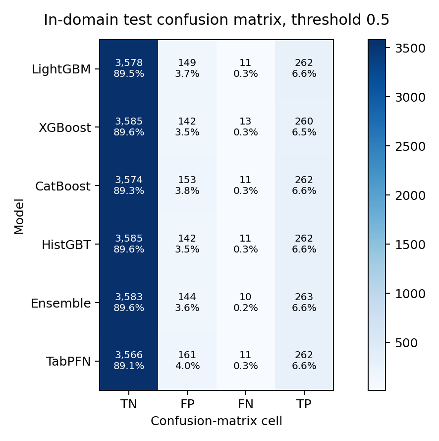
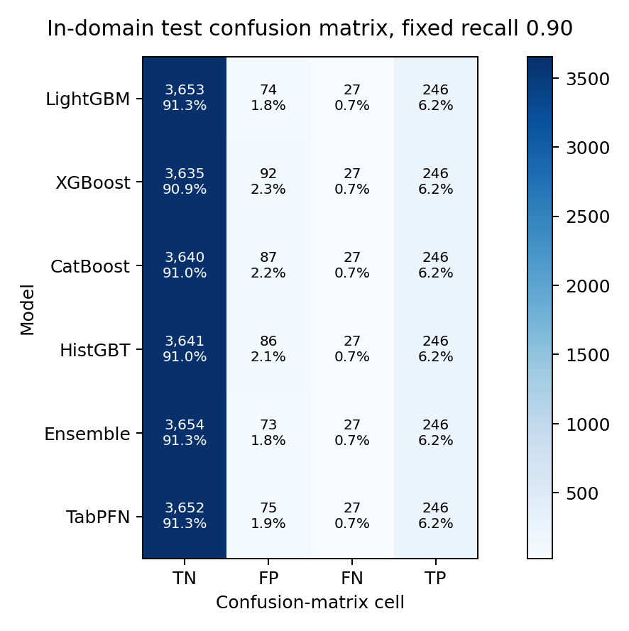
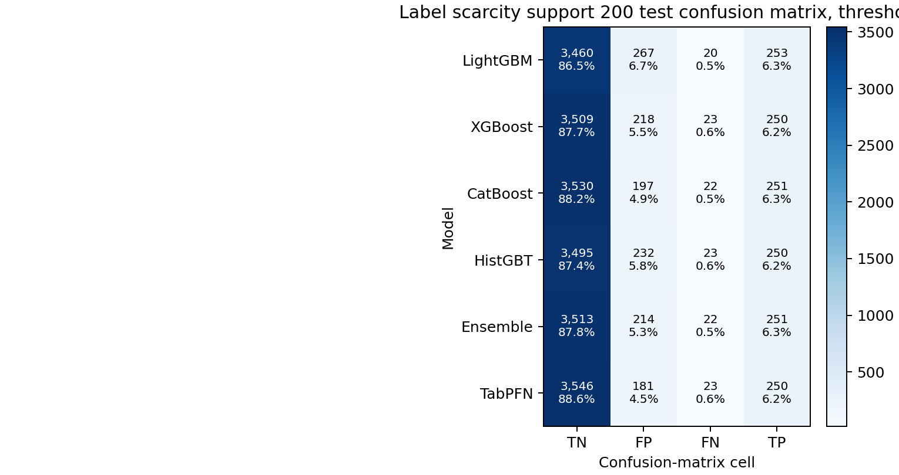
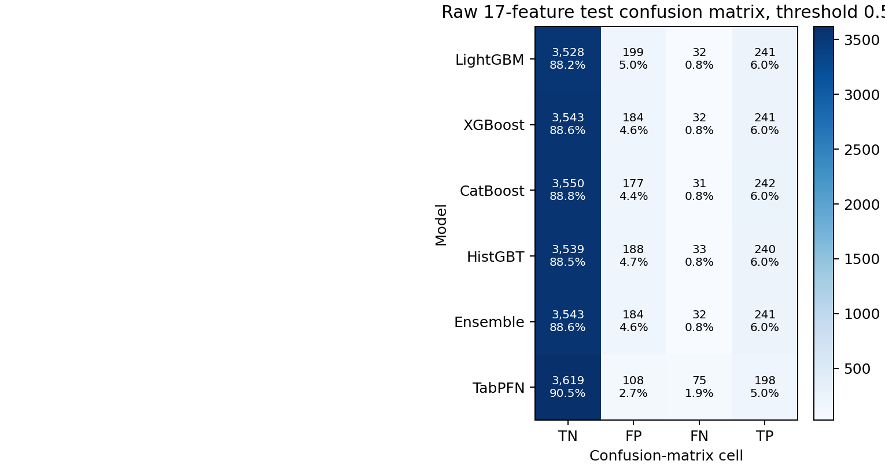
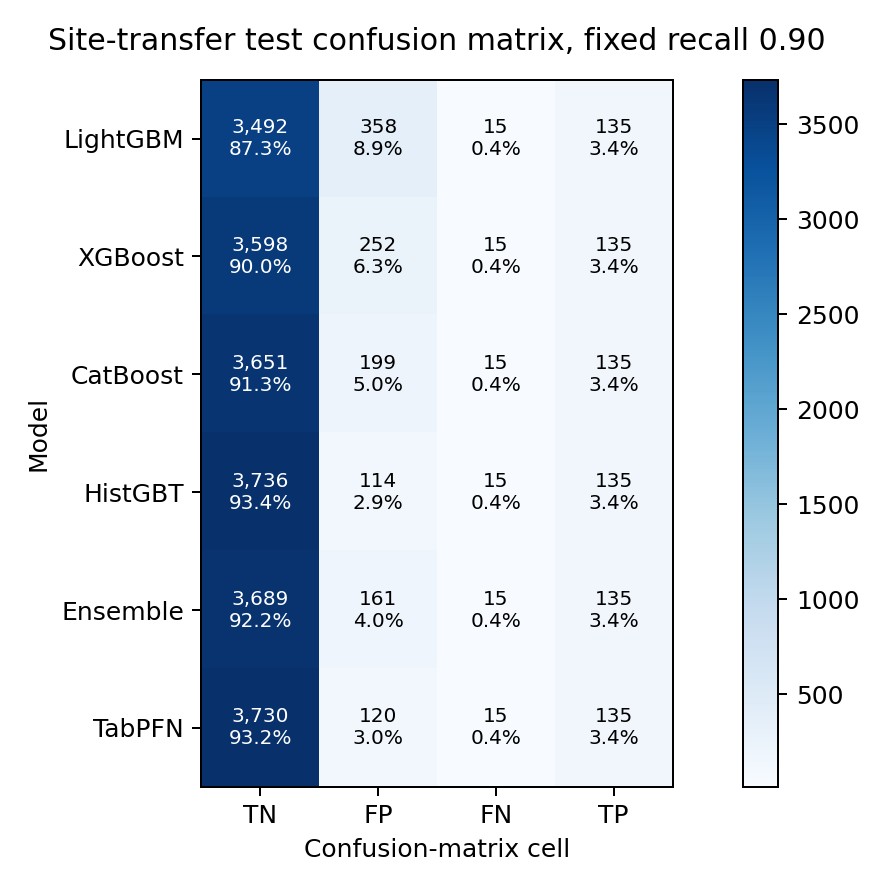

# M5：TabPFN 與 GBDT 跨部署情境總覽比較（in-domain／標註稀缺／minimal-FE／site-transfer）

- **Issue**：[#35](https://github.com/kuokuant-oss/lead-reproduction/issues/35)、[#52](https://github.com/kuokuant-oss/lead-reproduction/issues/52)

- 資料來源：ASHRAE GEPIII，來源：[Kaggle ASHRAE Energy Prediction](https://www.kaggle.com/competitions/ashrae-energy-prediction/data)。
- 資料集：data/raw/m3/train.csv、data/raw/m3/bad_meter_readings.csv、data/raw/m3/building_metadata.csv、data/raw/m3/weather_train.csv。
- Anomaly labels：來自 buds-lab bad_meter_readings.zip。

- **Feature basis**：`timestamp_merge` value-change features。
- **Split**：50% training / 50% testing。In-domain、label-scarcity、minimal-FE 使用 50/50 building split；site-transfer 使用 50/50 site split。
- **執行環境**：Intel Core i9-13980HX、31.6 GiB RAM、NVIDIA GeForce RTX 4070 Laptop GPU 8 GiB；所有模型在同一台機器上，使用各自預設且合理的設備 backend，由系統自由調度，並依序執行。
- **時間成本**：表內時間為各模型單一 cell 的 model-local fit/predict wall-clock。Tree models 使用 CPU backend，TabPFN 使用單張 CUDA GPU；Ensemble 時間為四個 tree 基模型的 fit/predict 時間合計。
- **輸出**：[data/processed/m6_phaseD_50_50_full_models_timestamp_merge.json](../../data/processed/m6_phaseD_50_50_full_models_timestamp_merge.json)。

---

## 1. 結論

TabPFN 的主要優勢仍出現在低標註量的 PR-AUC。
當 support 為 200 與 500 時，TabPFN 的 test PR-AUC 最高；support 增加後，
各模型差距快速收斂。

在 full features 的 in-domain 50/50 test split 上，六個模型分數接近。Test AUC
介於 0.9869 到 0.9915，test PR-AUC 介於 0.8994 到 0.9226。無明確模型排序。

Minimal feature engineering 顯示，raw features 下不同指標給出的訊號不同。

在 site-transfer 設定下，TabPFN test AUC 最高，但 test PR-AUC 仍低於 XGBoost
與 HistGBT。此軸以 anomaly ranking 來看，tree family 較強。

時間成本呈現清楚差距。十個 comparison cells 中，TabPFN 平均每 cell 為
`210.29` 秒；LightGBM、XGBoost、CatBoost 與 HistGBT 分別為 `0.244`、
`0.217`、`4.430` 與 `0.456` 秒。

---

## 2. 方法

每個 cell 內，六個模型使用相同 feature matrix、scaler、split、fit rows、train
scoring rows 與 test scoring rows。唯一變因是模型。

| 項目 | 設定 |
|---|---|
| Models | LightGBM、XGBoost、CatBoost、HistGBT、Ensemble、TabPFN |
| Feature regime | `timestamp_merge` |
| Full feature count | 137 features：17 baseline + 120 value-change |
| Minimal-FE count | 17 raw baseline features |
| Fit budget | 10,000 balanced rows；label-scarcity 另用 support sizes |
| Scoring budget | 4,000 natural-prevalence train rows 與 4,000 natural-prevalence test rows |
| In-domain split | `50_50_mod2`，依 `building_id % 2` 留出 |
| Site-transfer split | `site_id_mod2_50_50`，依 `site_id % 2` 留出 |
| AUC | AUC 指 ROC-AUC；PR-AUC 另列 |
| Confusion matrix | threshold `0.5` 與 fixed recall `0.90` |
| Timing | `time.perf_counter`；model-local fit/predict wall-clock，單位為秒 |

表內 Ensemble 時間以 `*` 標記，代表四個基模型 fit/predict 時間合計；預測分數組合成本未單獨計時。

資料表、137 個 features、split、sampling 和 scaling 準備完成後，表內時間記錄
各模型在單一 comparison cell 內執行 fit/predict 所花的時間。矩陣型實驗另列
「本軸合計」，呈現該實驗全部 cells 完成後各模型的累積時間。

Train/test 指標與 confusion matrix 都使用 natural-prevalence scoring subsample。
同一個 cell 內，六個模型使用同一批 scoring rows。JSON 內記錄 row-index fingerprint、
seed、sample size 與 prevalence。

Train/test 欄位意義如下：

| 欄位 | 意義 |
|---|---|
| Fit-set AUC | balanced fit-set 上的 AUC |
| Train AUC | train half 的 natural-prevalence scoring subsample AUC |
| Test AUC | test half 的 natural-prevalence scoring subsample AUC |

---

## 3. In-Domain

本節列出 full features 下的 fit-set、train 與 test 分數。Fit-set AUC 幾乎為
`1.0000`，train AUC 與 test AUC 也接近，未呈現明顯 train/test gap。

表 3：In-domain full-feature scores；regime=`timestamp_merge`，split ratio=50/50 building split。

| Model | Fit-set AUC | Train AUC | Test AUC | Test PR-AUC | 分流後模型時間 (s) |
|---|---:|---:|---:|---:|---:|
| LightGBM | 1.0000 | 0.9958 | 0.9871 | 0.9147 | 0.835 |
| XGBoost | 1.0000 | 0.9963 | 0.9869 | 0.8994 | 0.440 |
| CatBoost | 0.9995 | 0.9952 | 0.9884 | 0.9057 | 5.921 |
| HistGBT | 1.0000 | 0.9959 | 0.9888 | 0.9226 | 0.771 |
| Ensemble | 1.0000 | 0.9962 | 0.9895 | 0.9157 | 7.967* |
| TabPFN | 0.9999 | 0.9954 | 0.9915 | 0.9160 | 325.191 |

TabPFN 在本軸耗時 `325.19` 秒；四個 tree models 合計 `7.97` 秒。

Threshold `0.5` 下，所有模型都抓到超過 `95%` 的 test anomalies。TabPFN 抓到
`262/273`，漏掉 `11`，false alarms 為 `165`。Ensemble 抓到 `263/273`，漏掉
`10`，false alarms 為 `144`。

圖 3a：In-domain test confusion matrix；regime=`timestamp_merge`，split ratio=50/50 building split，threshold=`0.5`。

Fixed recall `0.90` 下，TabPFN 與 Ensemble 都抓到 `246/273` anomalies。此時
false alarms 分別為 `70` 與 `73`。

圖 3b：In-domain test confusion matrix；regime=`timestamp_merge`，split ratio=50/50 building split，fixed recall=`0.90`。

---

## 4. Label Scarcity

本節列出不同 support size 下的 test PR-AUC。

表 4a：Label-scarcity test PR-AUC；regime=`timestamp_merge`，split ratio=50/50 building split。

| Support | LightGBM | XGBoost | CatBoost | HistGBT | Ensemble | TabPFN |
|---:|---:|---:|---:|---:|---:|---:|
| 200 | 0.7098 | 0.6859 | 0.7237 | 0.6755 | 0.7208 | 0.7401 |
| 500 | 0.7486 | 0.7143 | 0.7928 | 0.7263 | 0.7838 | 0.8300 |
| 1,000 | 0.8323 | 0.8232 | 0.8446 | 0.8128 | 0.8466 | 0.8623 |
| 2,000 | 0.8628 | 0.8394 | 0.8526 | 0.8534 | 0.8677 | 0.8627 |
| 5,000 | 0.9049 | 0.8939 | 0.9040 | 0.9106 | 0.9106 | 0.9140 |
| 10,000 | 0.9147 | 0.8994 | 0.9057 | 0.9226 | 0.9157 | 0.9195 |

Test AUC 在低 support 時也都偏高，因此本軸主要看 PR-AUC。

表 4b：Label-scarcity test ROC-AUC；regime=`timestamp_merge`，split ratio=50/50 building split。

| Support | LightGBM | XGBoost | CatBoost | HistGBT | Ensemble | TabPFN |
|---:|---:|---:|---:|---:|---:|---:|
| 200 | 0.9708 | 0.9713 | 0.9755 | 0.9655 | 0.9740 | 0.9757 |
| 500 | 0.9811 | 0.9740 | 0.9812 | 0.9770 | 0.9814 | 0.9831 |
| 1,000 | 0.9829 | 0.9799 | 0.9814 | 0.9802 | 0.9834 | 0.9856 |
| 2,000 | 0.9874 | 0.9855 | 0.9837 | 0.9870 | 0.9872 | 0.9875 |
| 5,000 | 0.9887 | 0.9881 | 0.9868 | 0.9889 | 0.9884 | 0.9916 |
| 10,000 | 0.9871 | 0.9869 | 0.9884 | 0.9888 | 0.9895 | 0.9918 |

表 4c：Label-scarcity model-local fit/predict time；單位為秒。

| Support | LightGBM | XGBoost | CatBoost | HistGBT | Ensemble | TabPFN |
|---:|---:|---:|---:|---:|---:|---:|
| 200 | 0.034 | 0.043 | 1.979 | 0.170 | 2.225* | 22.238 |
| 500 | 0.083 | 0.084 | 3.312 | 0.285 | 3.764* | 24.888 |
| 1,000 | 0.125 | 0.108 | 3.404 | 0.394 | 4.031* | 27.706 |
| 2,000 | 0.227 | 0.174 | 4.225 | 0.498 | 5.123* | 155.017 |
| 5,000 | 0.215 | 0.245 | 4.463 | 0.485 | 5.408* | 238.632 |
| 10,000 | 0.264 | 0.332 | 5.937 | 0.538 | 7.071* | 344.702 |
| **本軸合計** | **0.948** | **0.985** | **23.320** | **2.368** | **27.621**\* | **813.183** |

TabPFN 的時間由 support `200` 的 `22.24` 秒增加至 support `10,000` 的
`344.70` 秒；同一 cell 的 tree models 皆在 `6` 秒內完成。

Support `200` 的 confusion matrix 顯示，PR-AUC ranking 與 threshold `0.5`
classification 給出不同訊號。TabPFN 抓到 `250/273`，漏掉 `23`，false alarms 為
`181`；Ensemble 抓到 `251/273`，漏掉 `22`，false alarms 為 `214`。

圖 4：Label-scarcity support 200 test confusion matrix；regime=`timestamp_merge`，split ratio=50/50 building split，threshold=`0.5`。

---

## 5. Minimal Feature Engineering

Minimal-FE 比較 full 137 features 與 raw 17 features。

### 5.1 Full 137 Features

表 5a：Minimal-FE full 137-feature scores；regime=`timestamp_merge`，split ratio=50/50 building split。

| Model | Fit-set AUC | Train AUC | Test AUC | Test PR-AUC | 分流後模型時間 (s) |
|---|---:|---:|---:|---:|---:|
| LightGBM | 1.0000 | 0.9958 | 0.9871 | 0.9147 | 0.239 |
| XGBoost | 1.0000 | 0.9963 | 0.9869 | 0.8994 | 0.313 |
| CatBoost | 0.9995 | 0.9952 | 0.9884 | 0.9057 | 5.597 |
| HistGBT | 1.0000 | 0.9959 | 0.9888 | 0.9226 | 0.498 |
| Ensemble | 1.0000 | 0.9962 | 0.9895 | 0.9157 | 6.647* |
| TabPFN | 0.9999 | 0.9957 | 0.9916 | 0.9188 | 323.274 |

### 5.2 Raw 17 Features

表 5b：Minimal-FE raw 17-feature scores；regime=`timestamp_merge`，split ratio=50/50 building split。

| Model | Fit-set AUC | Train AUC | Test AUC | Test PR-AUC | 分流後模型時間 (s) |
|---|---:|---:|---:|---:|---:|
| LightGBM | 0.9985 | 0.9876 | 0.9624 | 0.8323 | 0.115 |
| XGBoost | 1.0000 | 0.9880 | 0.9670 | 0.8286 | 0.081 |
| CatBoost | 0.9966 | 0.9857 | 0.9614 | 0.8323 | 3.345 |
| HistGBT | 0.9982 | 0.9877 | 0.9620 | 0.8318 | 0.347 |
| Ensemble | 0.9992 | 0.9881 | 0.9660 | 0.8438 | 3.888* |
| TabPFN | 1.0000 | 0.9934 | 0.9463 | 0.7746 | 285.320 |

TabPFN 在 full 137 features 與 raw 17 features 分別耗時 `323.27` 與 `285.32`
秒；四個 tree models 的對應合計為 `6.65` 與 `3.89` 秒。

表 5c：Minimal-FE 全軸各模型累積時間；單位為秒。

| LightGBM | XGBoost | CatBoost | HistGBT | Ensemble | TabPFN |
|---:|---:|---:|---:|---:|---:|
| 0.354 | 0.394 | 8.941 | 0.845 | 10.535* | 608.595 |

Raw 17 features 下，ranking metric 與 fixed-threshold classification 給出不同訊號。
Tree models 的 test PR-AUC 較高；TabPFN 在 threshold 0.5 下 TN 最高、FP 最少。

圖 5：Raw 17-feature test confusion matrix；regime=`timestamp_merge`，split ratio=50/50 building split，threshold=`0.5`。

---

## 6. Site-Transfer

本節列出 site-transfer split 下的 fit-set、train 與 test 分數。

表 6：Site-transfer full-feature scores；regime=`timestamp_merge`，split ratio=50/50 site split。

| Model | Fit-set AUC | Train AUC | Test AUC | Test PR-AUC | 分流後模型時間 (s) |
|---|---:|---:|---:|---:|---:|
| LightGBM | 1.0000 | 0.9980 | 0.9609 | 0.6182 | 0.305 |
| XGBoost | 1.0000 | 0.9979 | 0.9708 | 0.6778 | 0.350 |
| CatBoost | 0.9996 | 0.9974 | 0.9749 | 0.6463 | 6.113 |
| HistGBT | 1.0000 | 0.9976 | 0.9775 | 0.6739 | 0.578 |
| Ensemble | 1.0000 | 0.9980 | 0.9774 | 0.6563 | 7.346* |
| TabPFN | 1.0000 | 0.9963 | 0.9820 | 0.6392 | 355.960 |

TabPFN 在 site-transfer 耗時 `355.96` 秒；四個 tree models 合計 `7.35` 秒。

Threshold `0.5` 下，TabPFN 抓到最多 anomalies，false alarms 也較高。

圖 6a：Site-transfer test confusion matrix；regime=`timestamp_merge`，split ratio=50/50 site split，threshold=`0.5`。

Fixed recall `0.90` 下，HistGBT 與 TabPFN 都抓到 `135/150` anomalies，false
alarms 都是 `114`；Ensemble 同樣抓到 `135/150`，false alarms 為 `161`。

圖 6b：Site-transfer test confusion matrix；regime=`timestamp_merge`，split ratio=50/50 site split，fixed recall=`0.90`。

---

## 7. Value-Change Regime Sensitivity

本節以 `timestamp_merge` 作為 canonical value-change baseline；它是 buds-lab
原作 `timestamp + timedelta` 後 merge 的忠實版本。`row_offset` 與
`row_offset_meter_aware` 保留為歷史近似 ablation，用來界定早期 row-offset
假設對 cross-model comparison 的影響。GBDT / LightGBM 行以共同 GBDT anchor
對照，TabPFN 行以 TabPFN 對照。

| Regime | Source | Model line | In-domain ROC-AUC | In-domain PR-AUC | Site-transfer ROC-AUC | Site-transfer PR-AUC | Delta vs canonical ROC/PR |
|---|---|---|---:|---:|---:|---:|---:|
| `timestamp_merge` | `m6_phaseD_50_50_full_models_timestamp_merge.json` | GBDT / LightGBM | 0.9871 | 0.9147 | 0.9609 | 0.6182 | canonical |
| `row_offset` | `legacy/m5_phaseD_foundation_vs_gbdt_row_offset_baseline_superseded.json` | GBDT / LightGBM | 0.9877 | 0.9154 | 0.9797 | 0.8221 | in +0.0006/+0.0007; site +0.0188/+0.2039 |
| `row_offset_meter_aware` | `m6_phaseD_50_50_full_models.json` | GBDT / LightGBM | 0.9941 | 0.9255 | 0.9669 | 0.6224 | in +0.0070/+0.0108; site +0.0060/+0.0042 |
| `timestamp_merge` | `m6_phaseD_50_50_full_models_timestamp_merge.json` | TabPFN | 0.9915 | 0.9160 | 0.9820 | 0.6392 | canonical |
| `row_offset` | `legacy/m5_phaseD_foundation_vs_gbdt_row_offset_baseline_superseded.json` | TabPFN | 0.9925 | 0.9253 | 0.9833 | 0.8119 | in +0.0010/+0.0093; site +0.0013/+0.1727 |
| `row_offset_meter_aware` | `m6_phaseD_50_50_full_models.json` | TabPFN | 0.9947 | 0.9295 | 0.9756 | 0.5479 | in +0.0032/+0.0135; site -0.0064/-0.0913 |

模型比較的結論對 value-change 對齊方式穩健：in-domain 仍是各模型接近、低
support 下 TabPFN 的 PR-AUC 較強，site-transfer 的 PR-AUC 仍顯示 tree family
較強；deltas 見上表。

---

## 8. 數字與程式碼索引

| 項目 | 程式碼 | 輸出 |
|---|---|---|
| 50/50 six-model comparison | [scripts/run_m6_phaseD_50_50_full_models.py](../../scripts/run_m6_phaseD_50_50_full_models.py) | [data/processed/m6_phaseD_50_50_full_models_timestamp_merge.json](../../data/processed/m6_phaseD_50_50_full_models_timestamp_merge.json) |
| Confusion matrix figures | generated from [data/processed/m6_phaseD_50_50_full_models_timestamp_merge.json](../../data/processed/m6_phaseD_50_50_full_models_timestamp_merge.json) | [docs/reports/assets/m5/](assets/m5/) |
| Timestamp-merge multi-seed comparison | [scripts/run_m5_phaseD_foundation_vs_gbdt.py](../../scripts/run_m5_phaseD_foundation_vs_gbdt.py) | [data/processed/m6_phaseD_timestamp_merge_multiseed.json](../../data/processed/m6_phaseD_timestamp_merge_multiseed.json) |
| Timestamp-merge TabPFN feasibility spike | [scripts/run_m5_phaseC_tabpfn_spike.py](../../scripts/run_m5_phaseC_tabpfn_spike.py), [tests/test_m5_tabpfn_spike.py](../../tests/test_m5_tabpfn_spike.py) | [data/processed/m5_phaseC_tabpfn_spike_timestamp_merge.json](../../data/processed/m5_phaseC_tabpfn_spike_timestamp_merge.json) |
| Legacy row_offset regime ladder inputs | [scripts/run_m5_phaseD_foundation_vs_gbdt.py](../../scripts/run_m5_phaseD_foundation_vs_gbdt.py), [scripts/run_m5_phaseC_tabpfn_spike.py](../../scripts/run_m5_phaseC_tabpfn_spike.py) | [data/processed/legacy/](../../data/processed/legacy/) |
| Meter-aware regime ladder input | [scripts/run_m6_phaseD_50_50_full_models.py](../../scripts/run_m6_phaseD_50_50_full_models.py) | [data/processed/m6_phaseD_50_50_full_models.json](../../data/processed/m6_phaseD_50_50_full_models.json) |
| Comparison regression tests | [tests/test_m5_phaseD_comparison.py](../../tests/test_m5_phaseD_comparison.py), [tests/test_m5_timestamp_merge_regime.py](../../tests/test_m5_timestamp_merge_regime.py) | local test gate |
| Frozen pipeline helpers | [src/lead/data.py](../../src/lead/data.py), [src/lead/features.py](../../src/lead/features.py), [src/lead/split.py](../../src/lead/split.py), [src/lead/sample.py](../../src/lead/sample.py), [src/lead/evaluate.py](../../src/lead/evaluate.py) | [tests/golden_metrics.json](../../tests/golden_metrics.json) |
