# M5 labeled-data scarcity experiments (submission draft)

This package contains two distinct experiments. They share the odd-building holdout, 137-feature representation, models, and reporting metric, but they implement different scarcity interventions. Each experiment is therefore presented completely before any cross-experiment synthesis.

## Experiment A — matched-context row scarcity

### Experiment A objective

Measure sensitivity to the number of labeled context rows, N, while source-building coverage remains nearly complete. Training contexts are nested with a 1:1 class ratio; evaluation uses the natural holdout distribution.

### Experiment A protocol

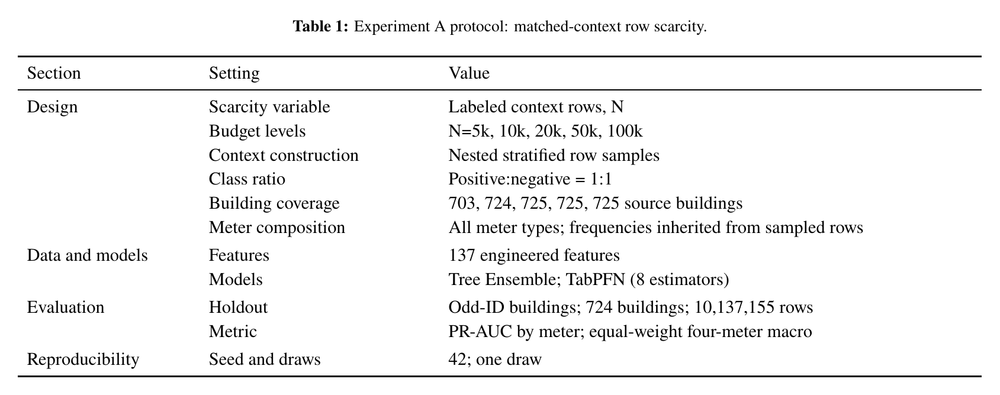

### Experiment A aggregate performance

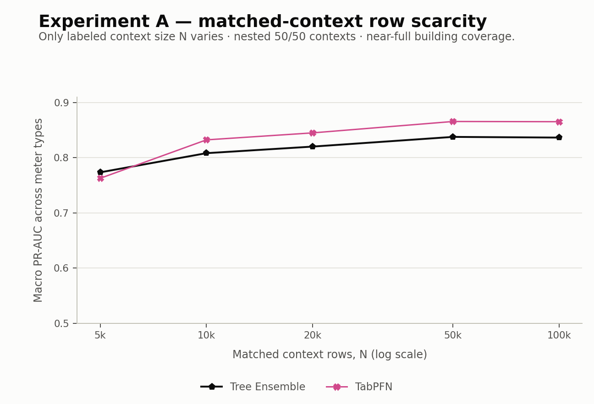

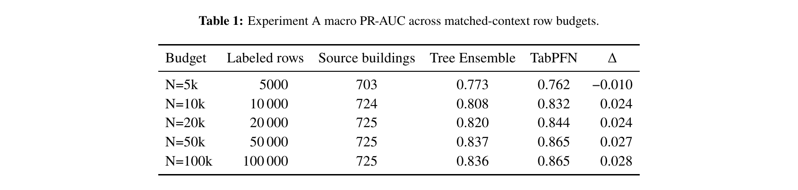

### Experiment A meter-level performance

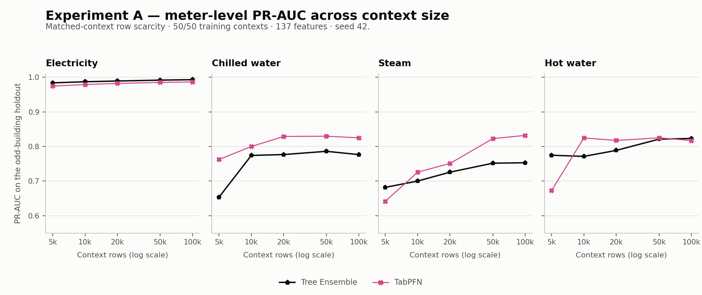

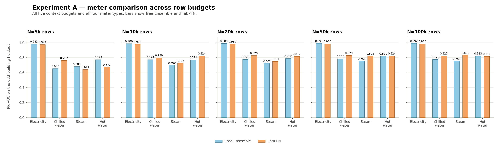

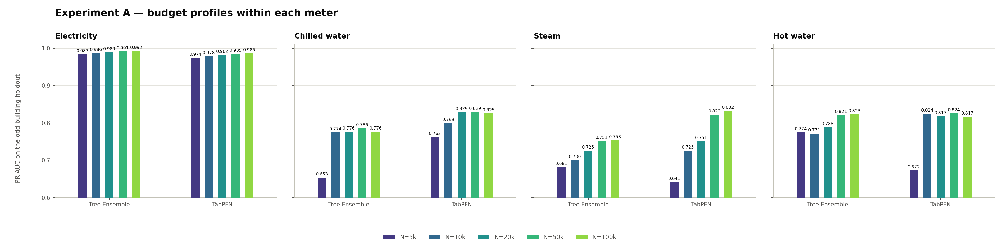

## Experiment B — representative source-building scarcity

### Experiment B objective

Measure sensitivity to the number of distinct labeled source buildings, K. The ladder is nested and representative; total context size is approximately 500 rows per building and the selected rows retain their natural class mix.

### Experiment B protocol

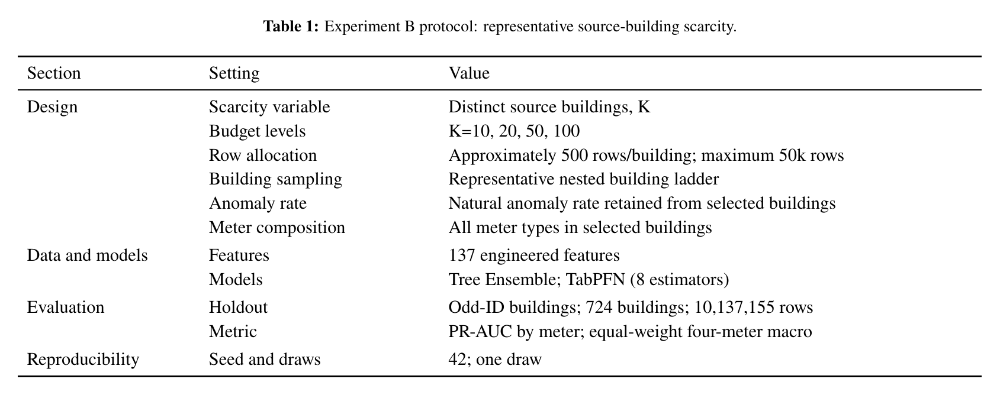

### Experiment B aggregate performance

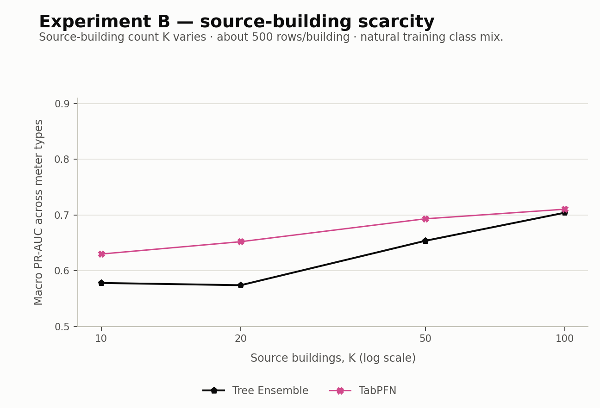

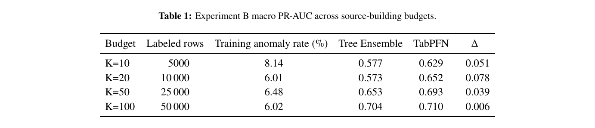

### Experiment B meter-level performance

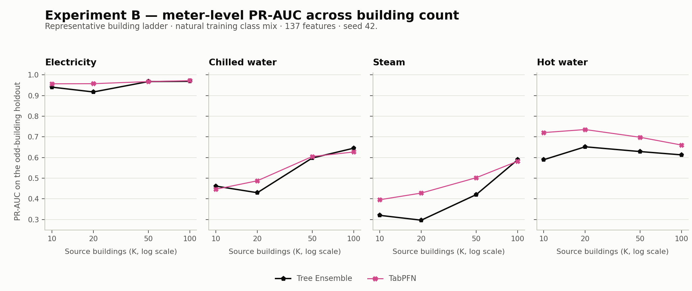

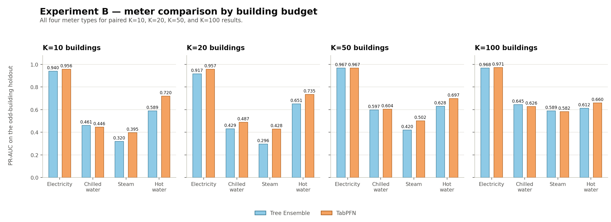

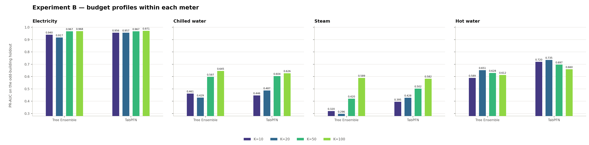

Paired result figures contain K=10, K=20, K=50, and K=100.

## Cross-experiment synthesis

These experiments answer complementary questions; their cells are not matched treatments. Experiment A varies row count under near-full building coverage and forced 1:1 training balance. Experiment B varies building diversity while row count grows with K and class balance remains natural. The following figures compare curve shape and coverage only; they must not be interpreted as a point-to-point contest between N and K budgets.

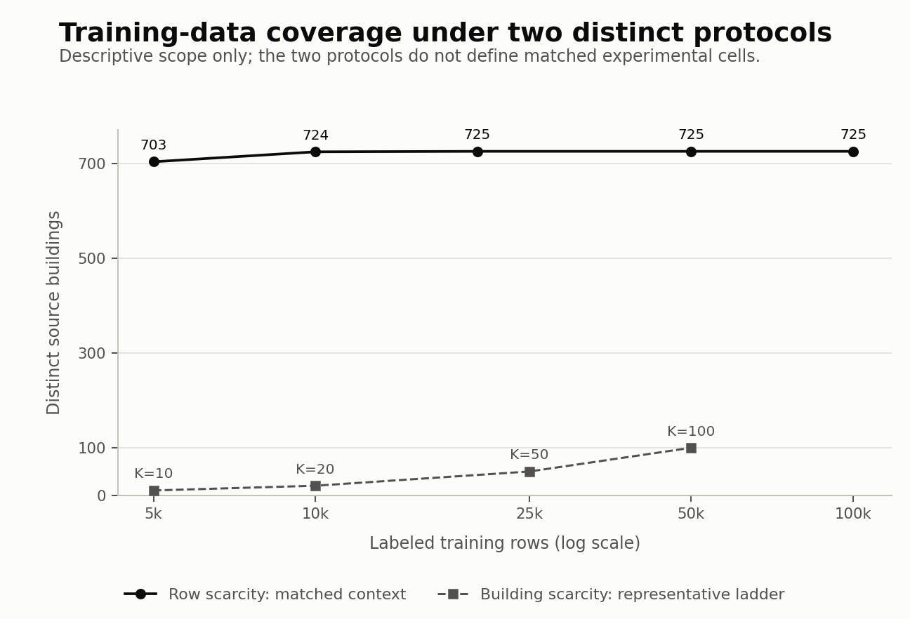

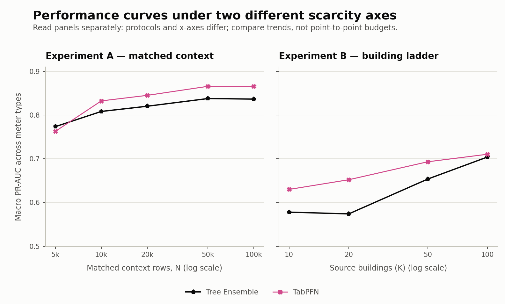

## Reporting conventions

- Primary measure: equal-weight macro PR-AUC across electricity, chilled water, steam, and hot water.
- Meter-level figures always retain all four meter types.
- Seed 42 represents one sampled draw.
- Protocol and numeric tables are provided as compilable LaTeX source and LaTeX-rendered PDF/PNG.
